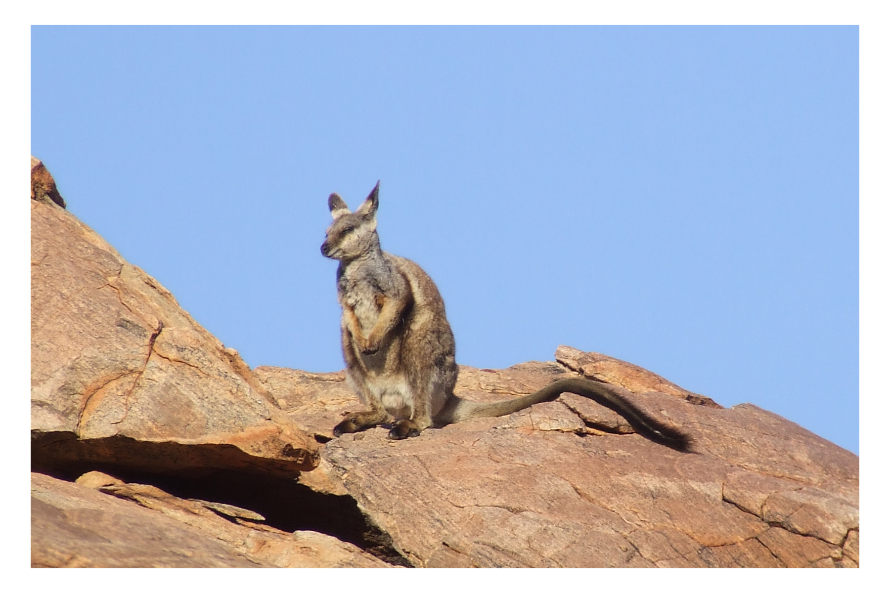

```{css, echo=FALSE}
h1, h2, h3 {
  text-align: center;
}
```

## **Black-footed rock-wallaby**
### *Petrogale lateralis*
### Blamed on cats

:::: {style="display: flex;"}



::: {}

:::

::: {}
  ```{r map, echo=FALSE, fig.cap="", out.width = '100%'}
  
  ```
:::

::::
<center>
IUCN status: **Vulnerable**

EPBC Predator Threat Rating: **Not assessed**

IUCN claim: *"Predation by feral cats is also occurring."*

</center>

### Studies in support

Cats hunt rock-wallabies (Paltridge et al. 1997; Read et al. 2018).

### Studies not in support

Cat prey preference for rock-wallabies was relatively low (Read et al. 2018).

### Is the threat claim evidence-based?

There are no studies linking cats to black-footed rock-wallaby population trends.
<br>
<br>

![**Evidence linking *Petrogale lateralis* to cats.** Systematic review of evidence for an association between *Petrogale lateralis* and cats. Positive studies are in support of the hypothesis that *cats* contribute to the decline of Petrogale lateralis, negative studies are not in support. Predation studies include studies documenting hunting or scavenging; baiting studies are associations between poison baiting and threatened mammal abundance where information on predator abundance is not provided; population studies are associations between threatened mammal and predator abundance. See methods section in [current submission] for details on evidence categories.](assets/figures/Main_Evidence_Cat_Petrogale lateralis.png)

### References

Current submission (2023) Scant evidence that introduced predators cause extinctions.

IUCN Red List. https://www.iucnredlist.org/ Accessed June 2023

Paltridge, R., Gibson, D. and Edwards, G., 1997. Diet of the feral cat (Felis catus) in central Australia. Wildlife Research, 24(1), pp.67-76.

Read, J.L., Dagg, E. and Moseby, K.E., 2018. Prey selectivity by feral cats at central Australian rock-wallaby colonies. Australian Mammalogy, 41(1), pp.132-141.

