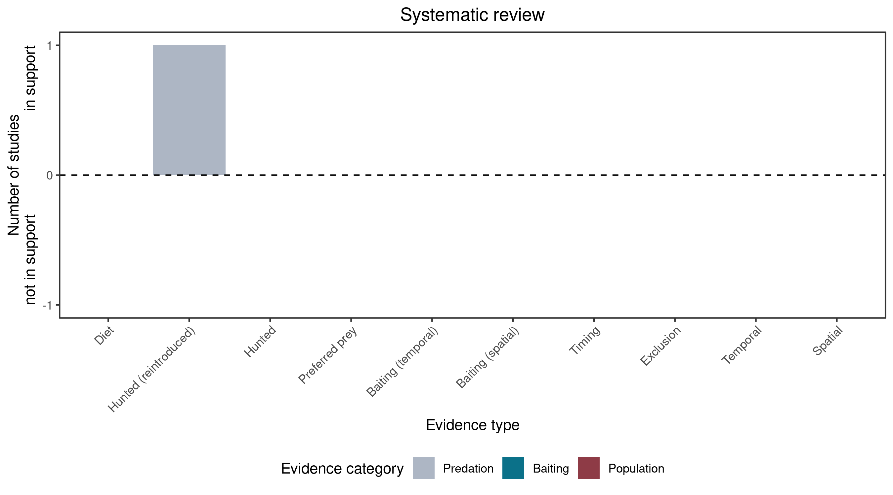

```{css, echo=FALSE}
h1, h2, h3 {
  text-align: center;
}
```

## **Brush-tailed rock-wallaby**
### *Petrogale penicillata*

:::: {style="display: flex;"}

::: {}
  ```{r icon, echo=FALSE, fig.cap="", out.width = '100%'}
  knitr::include_graphics("assets/phylopics/PLACEHOLDER_ready.png")
  ```
:::

::: {}

:::

::: {}
  ```{r map, echo=FALSE, fig.cap="", out.width = '100%'}
  knitr::include_graphics("assets/figures/Map_Cat_Petrogale penicillata.png")
  ```
:::

::::
<center>
IUCN Status: **Vulnerable**

EPBC Threat Rating: **Minor**

IUCN Claim: *N/A'*

</center>

### Studies in support

Cats possibly hunt rock-wallabies (Doherty et al. 2015).

### Studies not in support

No studies

### Is the threat claim evidence-based?

There are no studies linking cats to brush-tailed rock-wallaby populations.
<br>
<br>



### References

Doherty, Tim S., et al. "A continental‐scale analysis of feral cat diet in Australia." Journal of Biogeography 42.5 (2015): 964-975.

Wallach et al. 2023 In Submission

