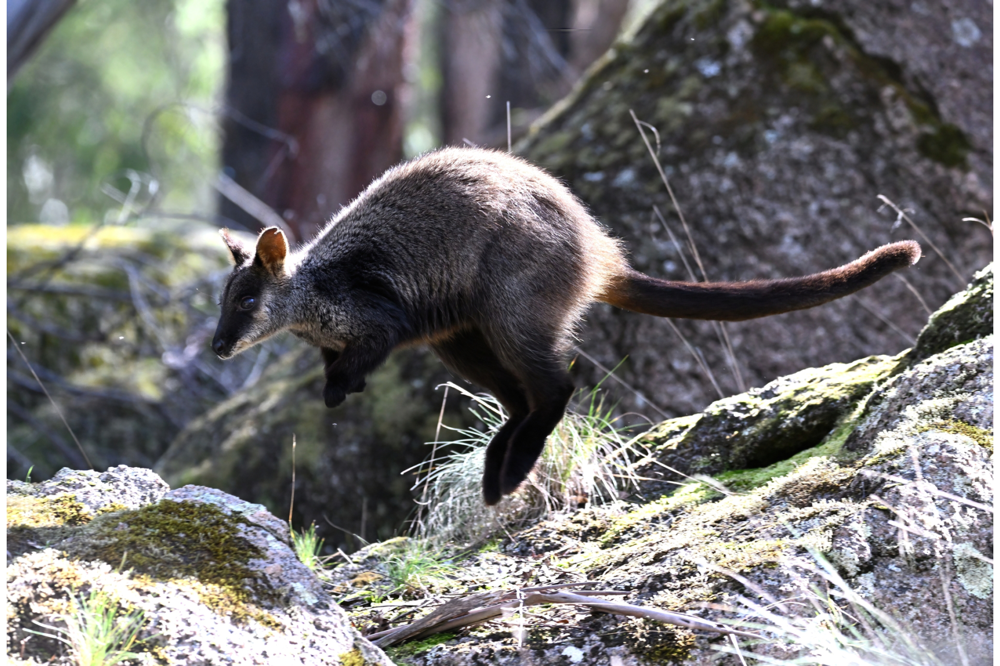

```{css, echo=FALSE}
h1, h2, h3 {
  text-align: center;
}
```

## **Brush-tailed rock-wallaby**
### *Petrogale penicillata*
### Blamed on cats

:::: {style="display: flex;"}

[](https://www.inaturalist.org/photos/225455018?size=original)

::: {}

:::

::: {}
  ```{r map, echo=FALSE, fig.cap="", out.width = '100%'}
  
  ```
:::

::::
<center>
IUCN status: **Vulnerable**

EPBC Predator Threat Rating: **Not assessed**

IUCN claim: *Not attributed*

</center>

### Studies in support

Cats possibly hunt rock-wallabies (Doherty et al. 2015).

### Studies not in support

No studies

### Is the threat claim evidence-based?

There are no studies linking cats to brush-tailed rock-wallaby population trends.
<br>
<br>

![**Evidence linking *Petrogale penicillata* to cats.** Systematic review of evidence for an association between *Petrogale penicillata* and cats. Positive studies are in support of the hypothesis that *cats* contribute to the decline of Petrogale penicillata, negative studies are not in support. Predation studies include studies documenting hunting or scavenging; baiting studies are associations between poison baiting and threatened mammal abundance where information on predator abundance is not provided; population studies are associations between threatened mammal and predator abundance. See methods section in [current submission] for details on evidence categories.](assets/figures/Main_Evidence_Cat_Petrogale penicillata.png)

### References

Current submission (2023) Scant evidence that introduced predators cause extinctions.

Doherty, T.S., Davis, R.A., van Etten, E.J., Algar, D., Collier, N., Dickman, C.R., Edwards, G., Masters, P., Palmer, R. and Robinson, S., 2015. A continental‐scale analysis of feral cat diet in Australia. Journal of Biogeography, 42(5), pp.964-975.

IUCN Red List. https://www.iucnredlist.org/ Accessed June 2023

