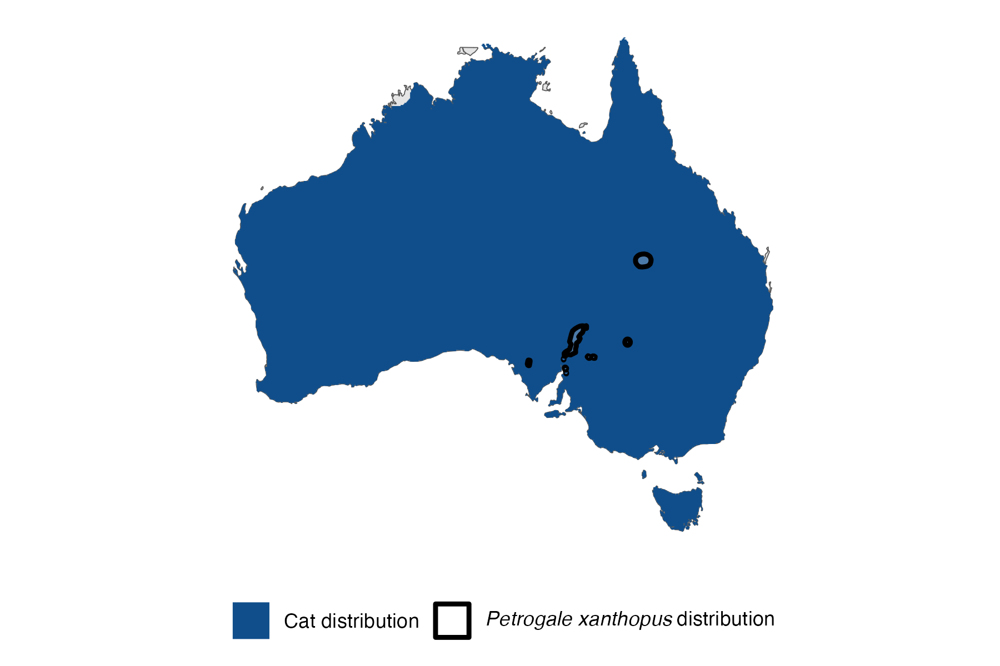

```{css, echo=FALSE}
h1, h2, h3 {
  text-align: center;
}
```

## **Yellow-footed rock-wallaby**
### *Petrogale xanthopus*
### Blamed on cats

:::: {style="display: flex;"}

[](https://www.inaturalist.org/photos/60874978?size=original)

::: {}

:::

::: {}
  ```{r map, echo=FALSE, fig.cap="", out.width = '100%'}
  
  ```
:::

::::
<center>
IUCN Status: **Near Threatened**

EPBC Threat Rating: **High**

IUCN Claim: *"N/A'"*

</center>

### Studies in support

Rock wallaby remains were found in the cat’s diet (Doherty et al. 2015).

### Studies not in support

Rock-wallaby remains were not found in the cat’s diet (Lapidge & Henshall 2001). Stobo-Wilson et al. (2020b) reported that rock-wallabies were detected at 2 sites but not at the other 2 sites, and that cats were detected at all 4, but no statistical analysis was provided.

### Is the threat claim evidence-based?

There are no studies evidencing a negative association between cats and yellow-footed rock-wallaby populations.
<br>
<br>

![**Evidence linking *Petrogale xanthopus* to cats.** Systematic review of evidence for an association between *Petrogale xanthopus* and cats. Positive studies are in support of the hypothesis that *cats* contribute to the decline of Petrogale xanthopus, negative studies are not in support. Predation studies include studies documenting hunting or scavenging; baiting studies are associations between poison baiting and threatened mammal abundance where information on predator abundance is not provided; population studies are associations between threatened mammal and predator abundance.](assets/figures/Main_Evidence_Cat_Petrogale xanthopus.png)

### References

Doherty, Tim S., et al. "A continental‐scale analysis of feral cat diet in Australia." Journal of Biogeography 42.5 (2015): 964-975.

Lapidge, Steven J., and Shane Henshall. "Diet Of Foxes And Cats, With Evidence Of Predation On Yellow-Footed Rock-Wallabies (Petrogale Xanthopus Celeris) By Foxes In Southwsetern Queensland." Australian Mammalogy 23.1 (2001): 47-52.

Stobo-Wilson Alyson M., Brandle Robert, Johnson Christopher N., Jones Menna E. (2020) Management of invasive mesopredators in the Flinders Ranges, South Australia: effectiveness and implications. Wildlife Research 47, 720-730.

Wallach et al. 2023 In Submission

