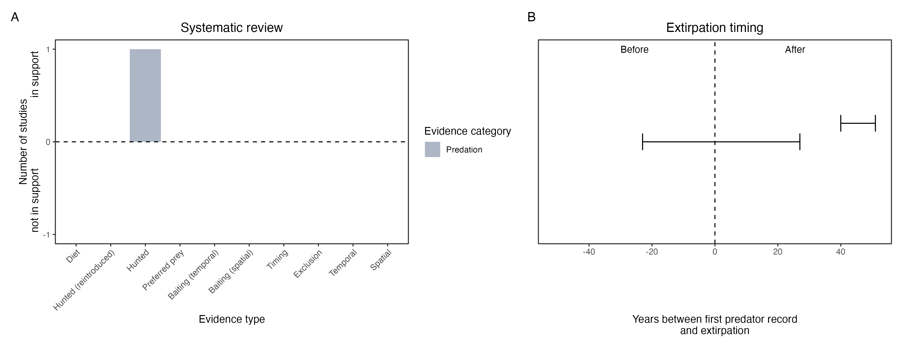

```{css, echo=FALSE}
h1, h2, h3 {
  text-align: center;
}
```

## **Red-tailed phascogale**
### *Phascogale calura*
### Blamed on cats

:::: {style="display: flex;"}

::: {}
  ```{r icon, echo=FALSE, fig.cap="", out.width = '100%'}
  knitr::include_graphics("assets/phylopics/PLACEHOLDER_ready.png")
  ```
:::

::: {}

:::

::: {}
  ```{r map, echo=FALSE, fig.cap="", out.width = '100%'}
  
  ```
:::

::::
<center>
IUCN Status: **Near Threatened**

EPBC Threat Rating: **Very high**

IUCN Claim: *'Predation by feral cats is considered to be a severe threat over the species' entire range, but has not been quantified. Predation by the Red Fox is considered a minor threat because of the arboreal behaviour of phascogales.''*

</center>

### Studies in support

No studies

### Studies not in support

Phascogales were last confirmed in NSW 18 years before cats arrived (Wallach et al. 202X).

### Is the threat claim evidence-based?

There are no studies linking cats to red-tailed phascogales. In contradiction with the claim the extipration record pre-dates the cat arrival record.
<br>
<br>



### References

Short, J. and Hide, A. (2012) Distribution and status of the redtailed phascogale (Phascogale calura). Australian Mammalogy, 34 (1). pp. 88-99.

Wallach et al. 2023 In Submission

