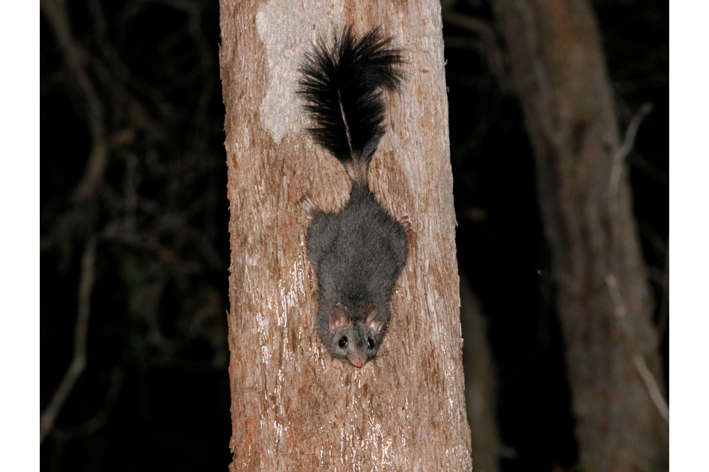

```{css, echo=FALSE}
h1, h2, h3 {
  text-align: center;
}
```

## **Brush-tailed phascogale**
### *Phascogale tapoatafa*
### Blamed on cats

:::: {style="display: flex;"}

[](https://www.inaturalist.org/photos/244633142?size=original)

::: {}

:::

::: {}
  ```{r map, echo=FALSE, fig.cap="", out.width = '100%'}
  
  ```
:::

::::
<center>
IUCN status: **Near Threatened**

EPBC Threat Rating: **High**

IUCN claim: *"The greatest current threat is predation by feral cats"*

</center>

### Studies in support

Cats hunted captive-bred reintroduced phascogales (Soderquist & Serena 1994).

### Studies not in support

Phascogale remained at low abundance as cat abundance declined, but no statistical analysis, control, or other variables were tested for (Wayne et al. 2017).

### Is the threat claim evidence-based?

There are no studies linking cats to brush-tailed phascogale populations.
<br>
<br>

![**Evidence linking *Phascogale tapoatafa* to cats.** Systematic review of evidence for an association between *Phascogale tapoatafa* and cats. Positive studies are in support of the hypothesis that *cats* contribute to the decline of Phascogale tapoatafa, negative studies are not in support. Predation studies include studies documenting hunting or scavenging; baiting studies are associations between poison baiting and threatened mammal abundance where information on predator abundance is not provided; population studies are associations between threatened mammal and predator abundance.](assets/figures/Main_Evidence_Cat_Phascogale tapoatafa.png)

### References

Current submission (2023) Scant evidence that introduced predators cause extinctions. Conservation Biology

EPBC. (2015) Threat Abatement Plan for Predation by Feral Cats. Environment Protection and Biodiversity Conservation Act 1999, Department of Environment, Government of Australia. (Table A1).

Soderquist, T.R. and Serena, M., 1994. An experimental reintroduction programme for brush-tailed phascogales (Phascogale tapoatafa): the interface between captivity and the wild. In Creative Conservation: Interactive Management of Wild and Captive Animals (pp. 431-438). Dordrecht: Springer Netherlands.

Wayne, A.F., Maxwell, M.A., Ward, C.G., Wayne, J.C., Vellios, C.V. and Wilson, I.J., 2017. Recoveries and cascading declines of native mammals associated with control of an introduced predator. Journal of Mammalogy, 98(2), pp.489-501.

