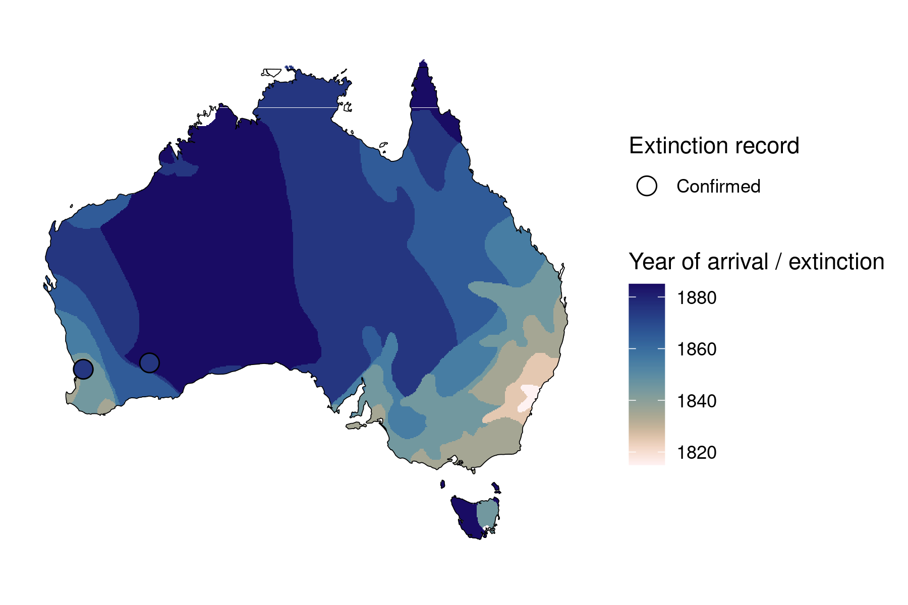
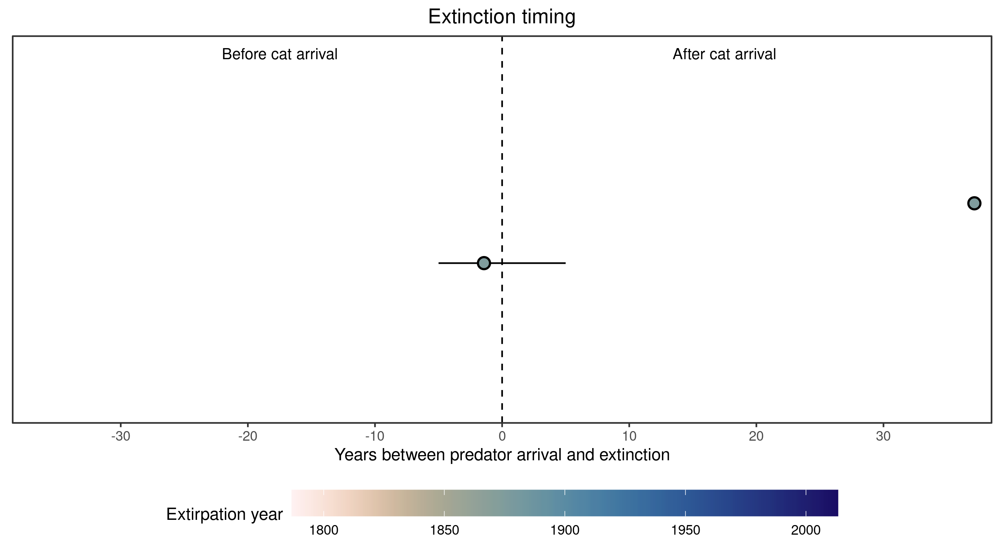

```{css, echo=FALSE}
h1, h2, h3 {
  text-align: center;
}
```

## **Broad-faced potoroo**
### *Potorous platyops*
### Blamed on cats

:::: {style="display: flex;"}

::: {}
  ```{r icon, echo=FALSE, fig.cap="", out.width = '100%'}
  knitr::include_graphics("assets/phylopics/PLACEHOLDER_ready.png")
  ```
:::

::: {}

:::

::: {}
  ```{r map, echo=FALSE, fig.cap="", out.width = '100%'}
  
  ```
:::

::::

<center>
IUCN Status: **Extinct**

Last Seen: *Potorous platyops were last seen in 1875 in South Western Australia*

</center>


### Studies in support

Broad-faced potoroos were last confirmed in Perth, WA 31 years after cats arrived (Wallach et al. 202X).

### Studies not in support

Broad-faced potoroos were last confirmed in Norseman, WA one year before cats arrived (Wallach et al. 202X).

### Is the threat claim evidence-based?

There are no studies evidencing a link between cats and the extinction of broad-faced potoroos. In contradiction with the claim, the extinction record from Norseman pre-dates the cat arrival record.
<br>
<br>



### References

Wallach et al. 2023 In Submission

