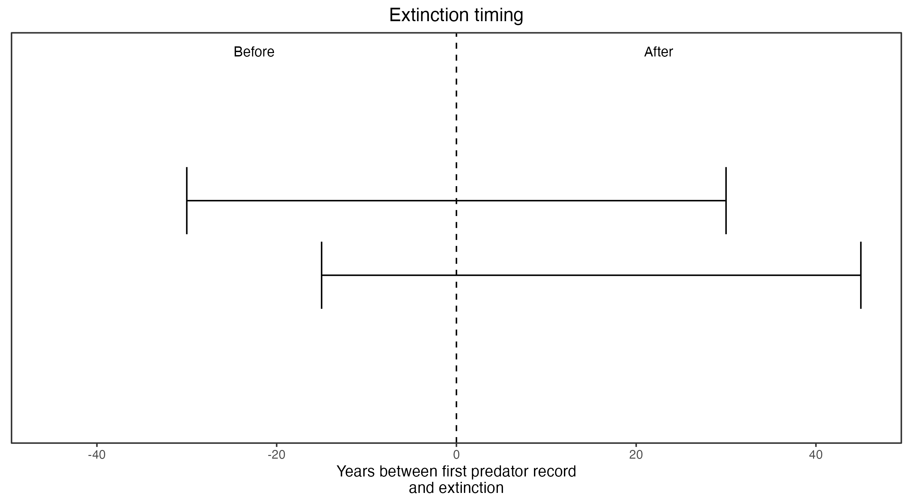

```{css, echo=FALSE}
h1, h2, h3 {
  text-align: center;
}
```

## **Broad-faced potoroo**
### *Potorous platyops*
### Blamed on cats

:::: {style="display: flex;"}

::: {}

[](https://en.wikipedia.org/wiki/Broad-faced_potoroo#/media/File:Potorous_platyops_Natural_History_Museum_Pisa.jpg)

:::

::: {}

:::

::: {}
  ```{r map, echo=FALSE, fig.cap="", out.width = '100%'}
  knitr::include_graphics("assets/figures/Map_Cat_Potorous platyops.png")
  ```
:::

::::

<center>
IUCN status: **Extinct**

Last seen: *1875*

IUCN claim: *"Predation by feral cats (severe, possibly catastrophic in combination with other threats)"*

</center>


### Studies in support

No studies

### Studies not in support

Broad-faced potoroos were last confirmed in WA (two records) 15 years before, to 45 years after, cats arrived (Current submission).

### Is the threat claim evidence-based?

No studies were found evidencing a link between cats and the extinction of broad-faced potoroos. It cannot be verrified that extinction occurred after cat arrival.
<br>
<br>



### References


Abbott, The spread of the cat, Felis catus, in Australia: re-examination of the current conceptual model with additional information. Conservation Science Western Australia 7 (2008).

Current submission (2023) Scant evidence that introduced predators cause extinctions.

IUCN Red List. https://www.iucnredlist.org/ Accessed June 2023

