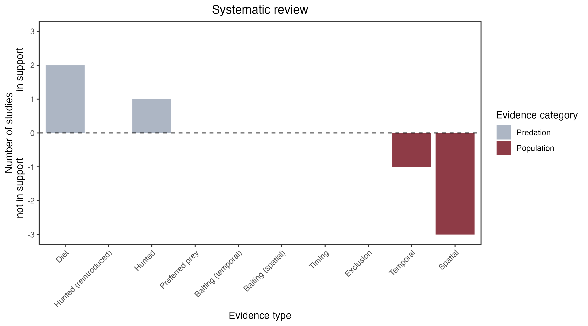

```{css, echo=FALSE}
h1, h2, h3 {
  text-align: center;
}
```

## **Long-nosed potoroo**
### *Potorous tridactylus*

:::: {style="display: flex;"}

::: {}
  ```{r icon, echo=FALSE, fig.cap="", out.width = '100%'}
  knitr::include_graphics("assets/phylopics/PLACEHOLDER_ready.png")
  ```
:::

::: {}

:::

::: {}
  ```{r map, echo=FALSE, fig.cap="", out.width = '100%'}
  
  ```
:::

::::
<center>
IUCN Status: **Near Threatened**

EPBC Threat Rating: **High**

IUCN Claim: *The major threat is predation, especially by the invasive Red Fox but also by wild dogs and feral cats. '*

</center>

### Studies in support

Remains of potoroo were found in the cat’s diet (Schwarz 1995; Lazenby 2012). Cats hunt potoroos (Miritis et al. 2020).

### Studies not in support

Norton et al. (2015) reported that potoroos were more common at a site with cats, compared to a neighbouring site where no cats were detected. Miritis et al. (2020) reported that potoroos and abundant cats were positively correlated in space and in daily activity patterns and that cat presence did not affect potoroo detection probability.

### Is the threat claim evidence-based?

There are no studies evidencing a negative association between cats and long-nosed potoroos. In contradiction with the claim, cats have been positively correlated with potoroos but causality cannot be determined due to confounding variables.
<br>
<br>



### References

Norton, Melinda A., et al. "Population characteristics and management of the long-nosed potoroo (Potorous tridactylus) in high-quality habitat in the Southern Highlands of New South Wales." Australian Mammalogy 37.1 (2015): 67-74

Schwarz E. 1995. Habitat use in a population of mainland Tasmanian feral cats, Felis catus. Grad.Dip. (Hons.) thesis. University of Tasmania, Hobart.

Lazenby BT. 2012. Do feral cats affect small mammals? A case study from the forests of southern Tasmania. PhD thesis, University of Sydney, Sydney.

Miritis, Vivianna; Rendall, Anthony R.; Doherty, Tim S.; Coetsee, Amy L.; Ritchie, Euan G. (2020). Living with the enemy: a threatened prey species coexisting with feral cats on a fox-free island. Wildlife Research, (), –. doi:10.1071/WR19202

Wallach et al. 2023 In Submission

