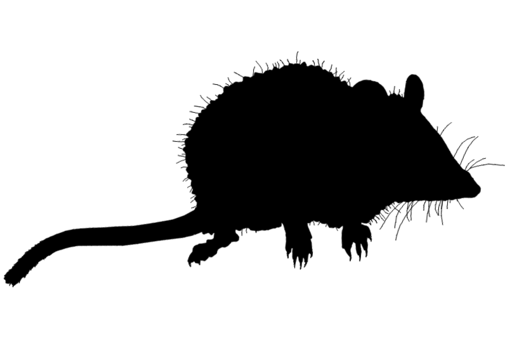

```{css, echo=FALSE}
h1, h2, h3 {
  text-align: center;
}
```

## **Alexandria false antechinus**
### *Pseudantechinus mimulus*
### Blamed on cats

:::: {style="display: flex;"}

[](https://www.phylopic.org/images/295cd9f7-eef2-441e-ba7e-40c772ca7611/antechinus-flavipes)

::: {}

:::

::: {}
  ```{r map, echo=FALSE, fig.cap="", out.width = '100%'}
  
  ```
:::

::::
<center>
IUCN Status: **Near Threatened**

EPBC Threat Rating: **Moderate**

IUCN Claim: *"predation by exotic predators'"*

</center>

### Studies in support

No studies

### Studies not in support

No studies

### Is the threat claim evidence-based?

There are no studies linking cats to Alexandria false antechinus.
<br>
<br>

![**Evidence linking *Pseudantechinus mimulus* to cats.** Systematic review of evidence for an association between *Pseudantechinus mimulus* and cats. Positive studies are in support of the hypothesis that *cats* contribute to the decline of Pseudantechinus mimulus, negative studies are not in support. Predation studies include studies documenting hunting or scavenging; baiting studies are associations between poison baiting and threatened mammal abundance where information on predator abundance is not provided; population studies are associations between threatened mammal and predator abundance.](assets/figures/Main_Evidence_Cat_Pseudantechinus mimulus.png)

### References


Wallach et al. 2023 In Submission

