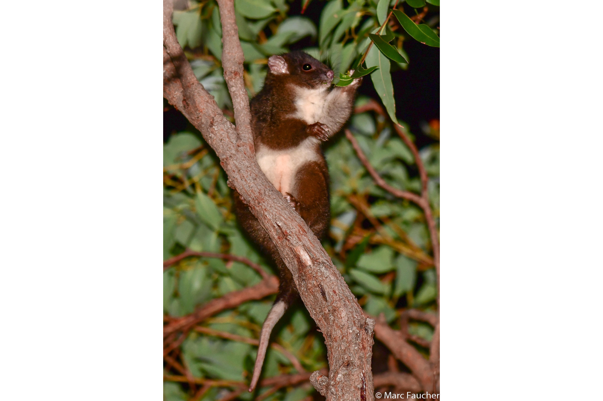

```{css, echo=FALSE}
h1, h2, h3 {
  text-align: center;
}
```

## **Western ringtail possum**
### *Pseudocheirus occidentalis*
### Blamed on cats

:::: {style="display: flex;"}

[](https://www.inaturalist.org/photos/31714307?size=original)

::: {}

:::

::: {}
  ```{r map, echo=FALSE, fig.cap="", out.width = '100%'}
  
  ```
:::

::::
<center>
IUCN status: **Critically Endangered**

EPBC Predator Threat Rating: **Very high/Extreme**

IUCN claim: *"Translocation experiments in the past and other data demonstrate that Red Foxes and feral Cats are major threats"*

</center>

### Studies in support

Cats hunted 6 of 68 reintroduced possums (Clarke 2011).

### Studies not in support

No studies

### Is the threat claim evidence-based?

No studies were found linking cats to Western ringtail possum population trends.
<br>
<br>

![**Evidence linking *Pseudocheirus occidentalis* to cats.** Systematic review of evidence for an association between *Pseudocheirus occidentalis* and cats. Positive studies are in support of the hypothesis that *cats* contribute to the decline of Pseudocheirus occidentalis, negative studies are not in support. Predation studies include studies documenting hunting or scavenging; baiting studies are associations between poison baiting and threatened mammal abundance where information on predator abundance is not provided; population studies are associations between threatened mammal and predator abundance. See methods section in [current submission] for details on evidence categories.](assets/figures/Main_Evidence_Cat_Pseudocheirus occidentalis.png)

### References

Clarke, J.R., 2011. Translocation outcomes for the western ringtail possum (Pseudocheirus occidentalis) in the presence of the common brushtail possum (Trichosurus vulpecula): health, survivorship and habitat use. Doctoral dissertation, Murdoch University.

Current submission (2023) Scant evidence that introduced predators cause extinctions.

EPBC. (2015) Threat Abatement Plan for Predation by Feral Cats. Environment Protection and Biodiversity Conservation Act 1999, Department of Environment, Government of Australia. (Table A1).

IUCN Red List. https://www.iucnredlist.org/ Accessed June 2023

Wayne, A.F., Rooney, J.F., Ward, C.G., Vellios, C.V. and Lindenmayer, D.B., 2005. The life history of Pseudocheirus occidentalis (Pseudocheiridae) in the jarrah forest of south-western Australia. Australian Journal of Zoology, 53(5), pp.325-337.

