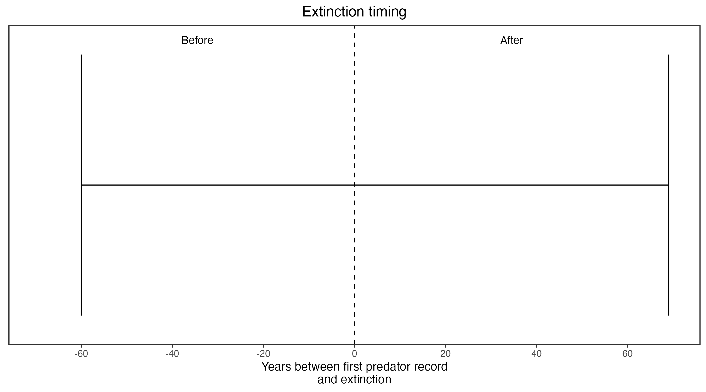

```{css, echo=FALSE}
h1, h2, h3 {
  text-align: center;
}
```

## **Long-eared mouse**
### *Pseudomys auritus*

:::: {style="display: grid; grid-template-columns: 1fr 1fr; grid-column-gap: 10px;"}

::: {}

IUCN Status: **Extinct**

Last seen: *Pseudomys auritus were last seen in 1850 (approximate) in Coorong through south-eastern SA to south-western Victoria*
:::

::: {}
  ```{r icon, echo=FALSE, fig.cap="", out.width = '100%'}
  knitr::include_graphics("assets/phylopics/PLACEHOLDER_ready.png")
  ```
:::

::::

### Studies in support

Long-eared mice were last confirmed 6 years after cats arrived (Wallach et al. 202X).

### Studies not in support

No studies

### Is the threat claim evidence-based?

There are no studies evidencing a link between cats and the extinction of long-eared mice.
<br>
<br>



### References

Wallach et al. 2023 In Submission

