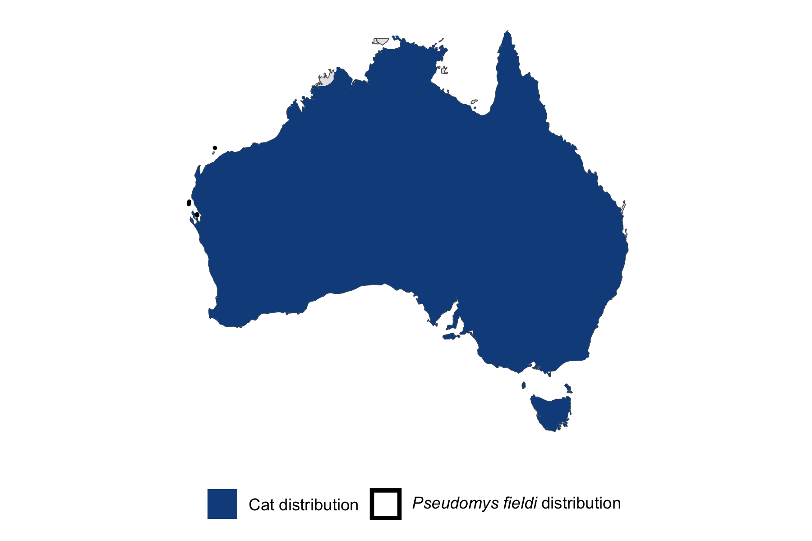

```{css, echo=FALSE}
h1, h2, h3 {
  text-align: center;
}
```

## **Gould's mouse**
### *Pseudomys fieldi*
### Blamed on cats

:::: {style="display: flex;"}

::: {}
  ```{r icon, echo=FALSE, fig.cap="", out.width = '100%'}
  knitr::include_graphics("assets/phylopics/PLACEHOLDER_ready.png")
  ```
:::

::: {}

:::

::: {}
  ```{r map, echo=FALSE, fig.cap="", out.width = '100%'}
  
  ```
:::

::::
<center>
IUCN Status: **Vulnerable**

EPBC Threat Rating: **Moderate**

IUCN Claim: *'Predation by feral Domestic Cats (Felis catus), Red Foxes (Vulpes vulpes) and Black Rats (Rattus rattus) could have severe to catastrophic effects if they establish on island. Feral Cats and Red Foxes have caused the extinction of medium-sized mammals on arid Australian islands''*

</center>

### Studies in support

Mouse last confirmed in the NT and south-west WA 2-20 years after cats arrived (Table S2).

### Studies not in support

Mouse was last confirmed in NSW 18 years before cats arrived (Table S2).

### Is the threat claim evidence-based?

There are no studies linking cats to Gould's mice. In contradiction with the claim, extirpation record from NSW pre-dates fox arrival record.
<br>
<br>

![**Fig. 1**  Systematic review of evidence for an association between *Pseudomys fieldi* and cats. Positive studies are in support of the hypothesis that cats contribute to the decline of Pseudomys fieldi, negative studies are not in support. Predation studies include studies documenting hunting or scavenging; baiting studies are associations between poison baiting and threatened mammal abundance where information on predator abundance is not provided; population studies are associations between threatened mammal and predator abundance.](assets/figures/Main_Evidence_Cat_Pseudomys fieldi.png)

### References


Wallach et al. 2023 In Submission

