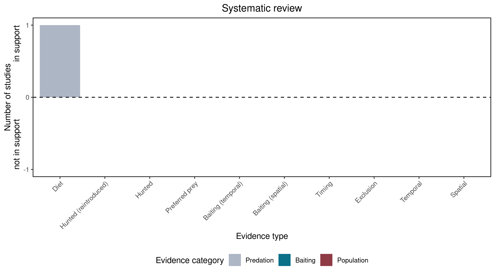

```{css, echo=FALSE}
h1, h2, h3 {
  text-align: center;
}
```

## **Smoky mouse**
### *Pseudomys fumeus*
### Blamed on cats

:::: {style="display: flex;"}

::: {}
  ```{r icon, echo=FALSE, fig.cap="", out.width = '100%'}
  knitr::include_graphics("assets/phylopics/PLACEHOLDER_ready.png")
  ```
:::

::: {}

:::

::: {}
  ```{r map, echo=FALSE, fig.cap="", out.width = '100%'}
  
  ```
:::

::::
<center>
IUCN Status: **Vulnerable**

EPBC Threat Rating: **Very high**

IUCN Claim: *'The species is significantly preyed upon by introduced Red Foxes (Vulpes vulpes), wild dogs (Canis lupus dingo), and feral Domestic Cats (Felis catus). ''*

</center>

### Studies in support

Cats hunt smoky mice (Cockburn 1981).

### Studies not in support

No studies

### Is the threat claim evidence-based?

There are no studies linking cats to smoky mouse populations.
<br>
<br>



### References

Cockburn, A. 1981. Population regulation and dispersion of the Smoky Mouse Pseudomys fumeus. II. Spring decline, breeding success and habitat heterogeneity. Australian Journal of Ecology 6: 255-266.

Wallach et al. 2023 In Submission

