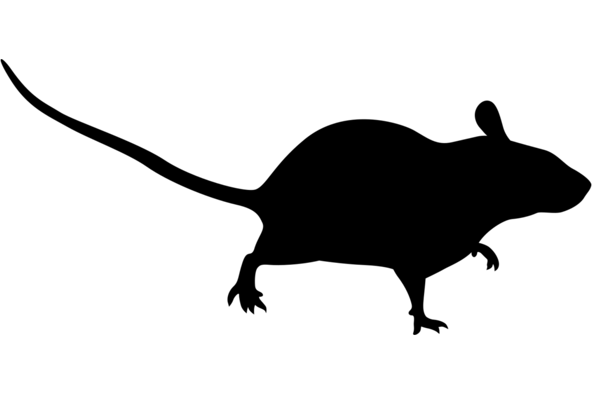
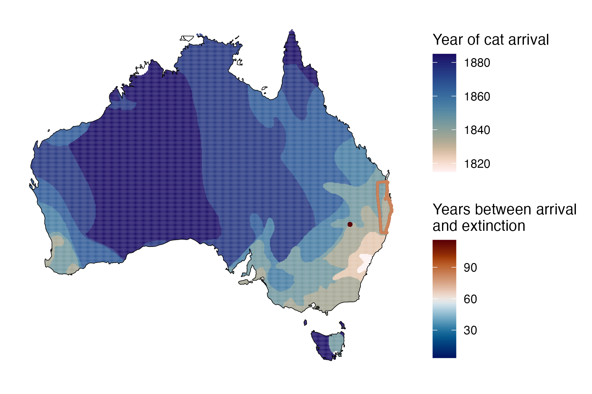
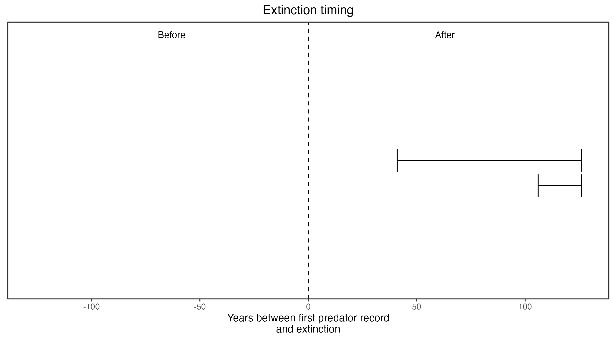

```{css, echo=FALSE}
h1, h2, h3 {
  text-align: center;
}
```

## **Blue-gray mouse**
### *Pseudomys glaucus*
### Blamed on cats

:::: {style="display: flex;"}

::: {}



:::

::: {}

:::

::: {}
  ```{r map, echo=FALSE, fig.cap="", out.width = '100%'}
  
  ```
:::

::::

<center>
IUCN status: **Extinct**

Last seen: *Pseudomys glaucus were last seen in 1956 between Burren and Walgett, northern NSW (IUCN 2023)*

IUCN claim: *"Extinction is considered to have been due to habitat clearance and predation by feral cats. Predation by red foxes may have contributed."*

</center>


### Studies in support

Blue-gray mice were last confirmed in the region of southeast QLD and northeast NSW and in north NSW 41-126 and 106-126 years after cats arrived, respectively (Current submission).

### Studies not in support

No studies

### Is the threat claim evidence-based?

No studies were found evidencing a link between cats and the extinction of blue-gray mice. The two species co-occurred for over a century before extinction.
<br>
<br>



### References


Abbott, The spread of the cat, Felis catus, in Australia: re-examination of the current conceptual model with additional information. Conservation Science Western Australia 7 (2008).

Current submission (2023) Scant evidence that introduced predators cause extinctions.

IUCN Red List. https://www.iucnredlist.org/ Accessed June 2023

