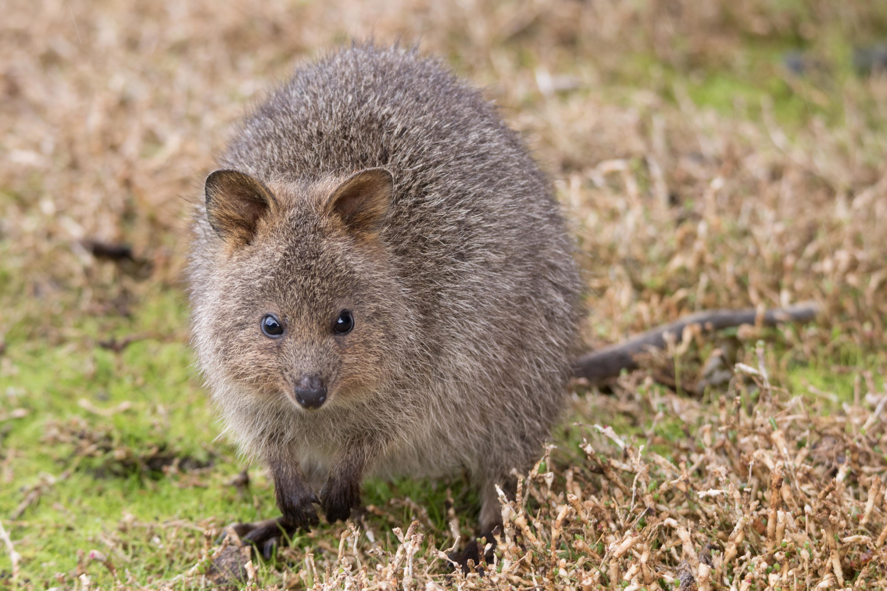

```{css, echo=FALSE}
h1, h2, h3 {
  text-align: center;
}
```

## **Quokka**
### *Setonix brachyurus*
### Blamed on cats

:::: {style="display: flex;"}

[](https://www.inaturalist.org/photos/2301295?size=original)

::: {}

:::

::: {}
  ```{r map, echo=FALSE, fig.cap="", out.width = '100%'}
  
  ```
:::

::::
<center>
IUCN status: **Vulnerable**

EPBC Predator Threat Rating: **Not assessed**

IUCN claim: *"Predation by red foxes and possibly feral cats has led to a past decline of mainland populations."*

</center>

### Studies in support

Cats hunt quokkas (Hayward et al. 2005; Bain 2015).

### Studies not in support

No studies

### Is the threat claim evidence-based?

There are no studies linking cats to quokka population trends.
<br>
<br>

![**Evidence linking *Setonix brachyurus* to cats.** Systematic review of evidence for an association between *Setonix brachyurus* and cats. Positive studies are in support of the hypothesis that *cats* contribute to the decline of Setonix brachyurus, negative studies are not in support. Predation studies include studies documenting hunting or scavenging; baiting studies are associations between poison baiting and threatened mammal abundance where information on predator abundance is not provided; population studies are associations between threatened mammal and predator abundance. See methods section in [current submission] for details on evidence categories.](assets/figures/Main_Evidence_Cat_Setonix brachyurus.png)

### References


Bain, K.T., 2015. The ecology of the quokka (Setonix brachyurus) in the southern forests of Western Australia. Doctoral Thesis, The University of Western Australia.

Current submission (2023) Scant evidence that introduced predators cause extinctions.

Hayward, M.W., de Tores, P.J., Augee, M.L. and Banks, P.B., 2005. Mortality and survivorship of the quokka (Setonix brachyurus)(Macropodidae: Marsupialia) in the northern jarrah forest of Western Australia. Wildlife Research, 32(8), pp.715-722.

IUCN Red List. https://www.iucnredlist.org/ Accessed June 2023

