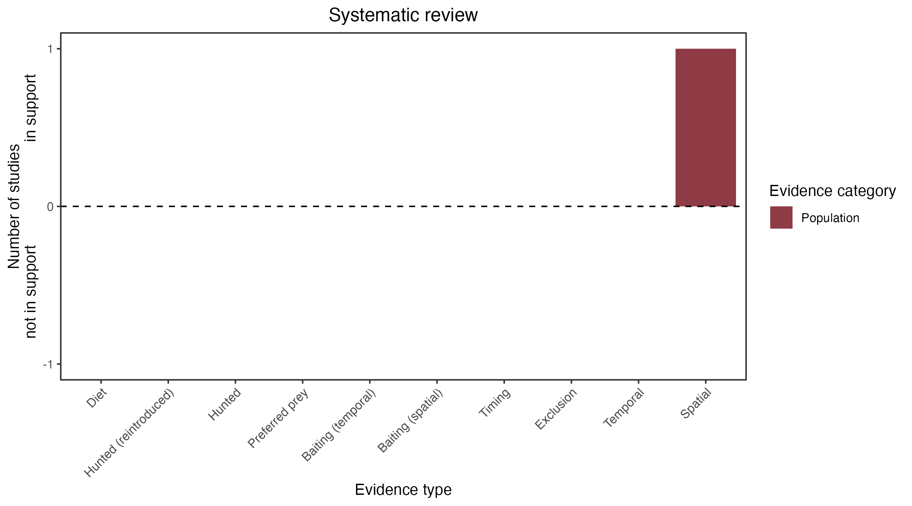

```{css, echo=FALSE}
h1, h2, h3 {
  text-align: center;
}
```

## **Carpentarian dunnart**
### *Sminthopsis butleri*
### Blamed on cats

:::: {style="display: flex;"}

::: {}
  ```{r icon, echo=FALSE, fig.cap="", out.width = '100%'}
  knitr::include_graphics("assets/phylopics/PLACEHOLDER_ready.png")
  ```
:::

::: {}

:::

::: {}
  ```{r map, echo=FALSE, fig.cap="", out.width = '100%'}
  knitr::include_graphics("assets/figures/Map_Cat_Sminthopsis butleri.png")
  ```
:::

::::
<center>
IUCN Status: **Near Threatened**

EPBC Threat Rating: **Moderate**

IUCN Claim: *'Exotic predators (cats and possibly dogs)''*

</center>

### Studies in support

Dunnarts were among small mammals negatively correlated with cat occupancy (Stobo-Wilson et al. 2020a)

### Studies not in support

No studies

### Is the threat claim evidence-based?

Cats have been documented among a range of ecological variables negatively correlated with Carpentarian dunnarts. Causality cannot be inferred due to confounding variables.
<br>
<br>



### References

Stobo-Wilson, A. M., et al. "Bottom-up and top-down processes influence contemporary patterns of mammal species richness in Australia's monsoonal tropics." Biological Conservation 247 (2020): 108638.

Wallach et al. 2023 In Submission

