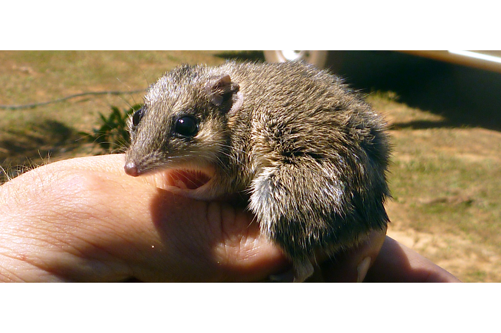
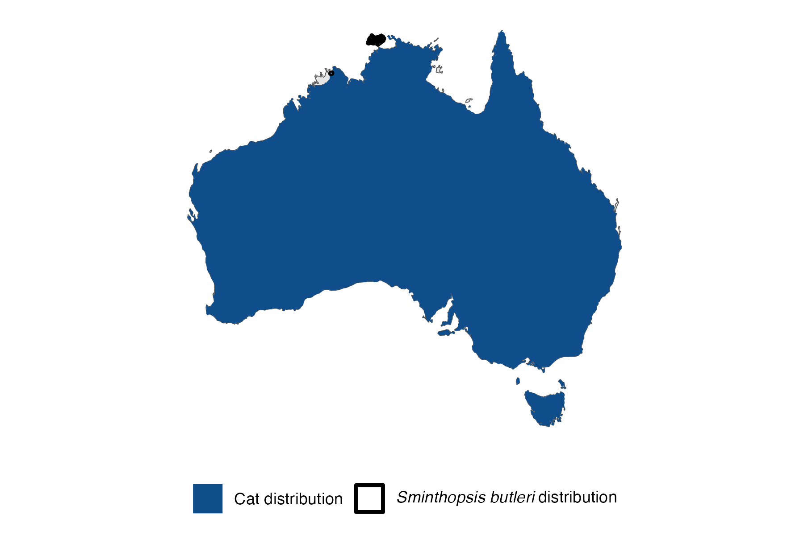

```{css, echo=FALSE}
h1, h2, h3 {
  text-align: center;
}
```

## **Carpentarian dunnart**
### *Sminthopsis butleri*
### Blamed on cats

:::: {style="display: flex;"}

[](https://en.wikipedia.org/wiki/Carpentarian_dunnart#/media/File:Sminthopsis_Butleri.jpg)

::: {}

:::

::: {}
  ```{r map, echo=FALSE, fig.cap="", out.width = '100%'}
  
  ```
:::

::::
<center>
IUCN status: **Near Threatened**

EPBC Predator Threat Rating: **Not assessed**

IUCN claim: *"Exotic predators (cats and possibly dogs)"*

</center>

### Studies in support

Carpentarian dunnarts were among small mammals negatively correlated with cat occupancy (Stobo-Wilson et al. 2020a)

### Studies not in support

No studies

### Is the threat claim evidence-based?

Cats have been documented among a range of ecological variables negatively correlated with Carpentarian dunnarts in one study. Causality for decline cannot be inferred due to confounding variables.
<br>
<br>

![**Evidence linking *Sminthopsis butleri* to cats.** Systematic review of evidence for an association between *Sminthopsis butleri* and cats. Positive studies are in support of the hypothesis that *cats* contribute to the decline of Sminthopsis butleri, negative studies are not in support. Predation studies include studies documenting hunting or scavenging; baiting studies are associations between poison baiting and threatened mammal abundance where information on predator abundance is not provided; population studies are associations between threatened mammal and predator abundance. See methods section in [current submission] for details on evidence categories.](assets/figures/Main_Evidence_Cat_Sminthopsis butleri.png)

### References

Current submission (2023) Scant evidence that introduced predators cause extinctions.

IUCN Red List. https://www.iucnredlist.org/ Accessed June 2023

Stobo-Wilson, A.M., Stokeld, D., Einoder, L.D., Davies, H.F., Fisher, A., Hill, B.M., Mahney, T., Murphy, B.P., Scroggie, M.P., Stevens, A. and Woinarski, J.C.Z., 2020. Bottom-up and top-down processes influence contemporary patterns of mammal species richness in Australia's monsoonal tropics. Biological Conservation, 247, p.108638.

