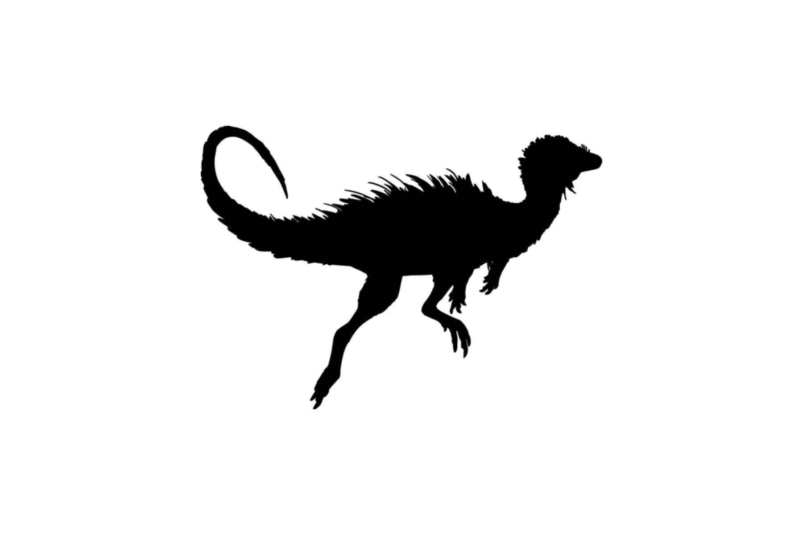

```{css, echo=FALSE}
h1, h2, h3 {
  text-align: center;
}
```

## **Sandhill dunnart**
### *Sminthopsis psammophila*
### Blamed on cats

:::: {style="display: flex;"}

::: {}
  ```{r icon, echo=FALSE, fig.cap="", out.width = '100%'}
  
  ```
:::

::: {}

:::

::: {}
  ```{r map, echo=FALSE, fig.cap="", out.width = '100%'}
  
  ```
:::

::::
<center>
IUCN Status: **Vulnerable**

EPBC Threat Rating: **Very high**

IUCN Claim: *'Major threats are predation by feral cats and Red Foxes''*

</center>

### Studies in support

No studies

### Studies not in support

No studies

### Is the threat claim evidence-based?

There are no studies linking cats to sandhill dunnarts.
<br>
<br>

![**Fig. 1**  Systematic review of evidence for an association between *Sminthopsis psammophila* and cats. Positive studies are in support of the hypothesis that cats contribute to the decline of Sminthopsis psammophila, negative studies are not in support. Predation studies include studies documenting hunting or scavenging; baiting studies are associations between poison baiting and threatened mammal abundance where information on predator abundance is not provided; population studies are associations between threatened mammal and predator abundance.](assets/figures/Main_Evidence_Cat_Sminthopsis psammophila.png)

### References


Wallach et al. 2023 In Submission

