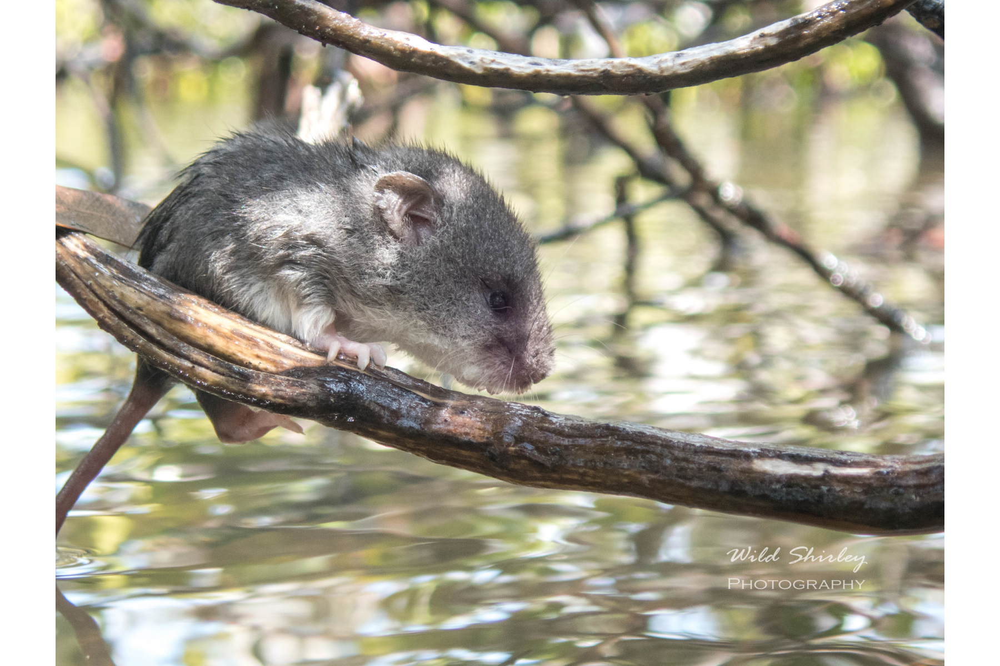

```{css, echo=FALSE}
h1, h2, h3 {
  text-align: center;
}
```

## **Water mouse**
### *Xeromys myoides*
### Blamed on cats

:::: {style="display: flex;"}

[](https://www.inaturalist.org/photos/75340382?size=original)

::: {}

:::

::: {}
  ```{r map, echo=FALSE, fig.cap="", out.width = '100%'}
  
  ```
:::

::::
<center>
IUCN status: **Vulnerable**

EPBC Threat Rating: **Moderate**

IUCN claim: *"Predation by feral Domestic Cats (Felis catus) may be a threat, but extent"*

</center>

### Studies in support

No studies

### Studies not in support

No studies

### Is the threat claim evidence-based?

There are no studies linking cats to water mice.
<br>
<br>

![**Evidence linking *Xeromys myoides* to cats.** Systematic review of evidence for an association between *Xeromys myoides* and cats. Positive studies are in support of the hypothesis that *cats* contribute to the decline of Xeromys myoides, negative studies are not in support. Predation studies include studies documenting hunting or scavenging; baiting studies are associations between poison baiting and threatened mammal abundance where information on predator abundance is not provided; population studies are associations between threatened mammal and predator abundance.](assets/figures/Main_Evidence_Cat_Xeromys myoides.png)

### References


EPBC. (2015) Threat Abatement Plan for Predation by Feral Cats. Environment Protection and Biodiversity Conservation Act 1999, Department of Environment, Government of Australia. (Table A1).

Wallach et al. 2023 In Submission

