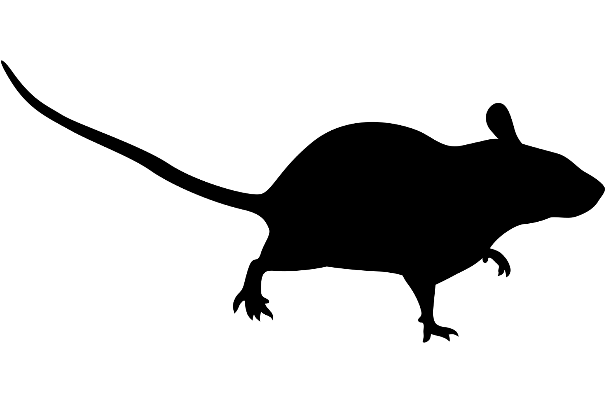

```{css, echo=FALSE}
h1, h2, h3 {
  text-align: center;
}
```

## **Carpentarian rock rat**
### *Zyzomys palatalis*
### Blamed on cats

:::: {style="display: flex;"}



::: {}

:::

::: {}
  ```{r map, echo=FALSE, fig.cap="", out.width = '100%'}
  knitr::include_graphics("assets/figures/Map_Cat_Zyzomys palatalis.png")
  ```
:::

::::
<center>
IUCN status: **Critically Endangered**

EPBC Predator Threat Rating: **Not assessed**

IUCN claim: *"Predation by feral cats may be a threat"*

</center>

### Studies in support

No studies

### Studies not in support

No studies

### Is the threat claim evidence-based?

There are no studies linking cats to Carpentarian rock rats.
<br>
<br>

![**Evidence linking *Zyzomys palatalis* to cats.** Systematic review of evidence for an association between *Zyzomys palatalis* and cats. Positive studies are in support of the hypothesis that *cats* contribute to the decline of Zyzomys palatalis, negative studies are not in support. Predation studies include studies documenting hunting or scavenging; baiting studies are associations between poison baiting and threatened mammal abundance where information on predator abundance is not provided; population studies are associations between threatened mammal and predator abundance. See methods section in [current submission] for details on evidence categories.](assets/figures/Main_Evidence_Cat_Zyzomys palatalis.png)

### References


Current submission (2023) Scant evidence that introduced predators cause extinctions.

IUCN Red List. https://www.iucnredlist.org/ Accessed June 2023

