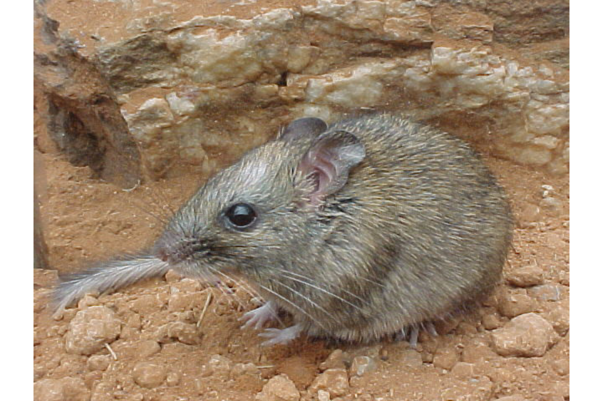

```{css, echo=FALSE}
h1, h2, h3 {
  text-align: center;
}
```

## **Central rock rat**
### *Zyzomys pedunculatus*
### Blamed on cats

:::: {style="display: flex;"}

[](https://en.wikipedia.org/wiki/Central_rock_rat#/media/File:Zyzomys_pedunculatus.jpg)

::: {}

:::

::: {}
  ```{r map, echo=FALSE, fig.cap="", out.width = '100%'}
  
  ```
:::

::::
<center>
IUCN Status: **Critically Endangered**

EPBC Threat Rating: **Very high**

IUCN Claim: *"Recent evidence has shown predation by feral cats'"*

</center>

### Studies in support

Cats hunt central rock rats (McDonald et al. 2014).

### Studies not in support

No studies

### Is the threat claim evidence-based?

There are no studies linking cats to central rock rat populations.
<br>
<br>

![**Evidence linking *Zyzomys pedunculatus* to cats.** Systematic review of evidence for an association between *Zyzomys pedunculatus* and cats. Positive studies are in support of the hypothesis that *cats* contribute to the decline of Zyzomys pedunculatus, negative studies are not in support. Predation studies include studies documenting hunting or scavenging; baiting studies are associations between poison baiting and threatened mammal abundance where information on predator abundance is not provided; population studies are associations between threatened mammal and predator abundance.](assets/figures/Main_Evidence_Cat_Zyzomys pedunculatus.png)

### References

McDonald, Peter J., et al. "A new population of the critically endangered central rock-rat (Zyzomys pedunculatus) discovered in the Northern Territory." Australian Mammalogy 37.1 (2014): 97-100.

Wallach et al. 2023 In Submission

