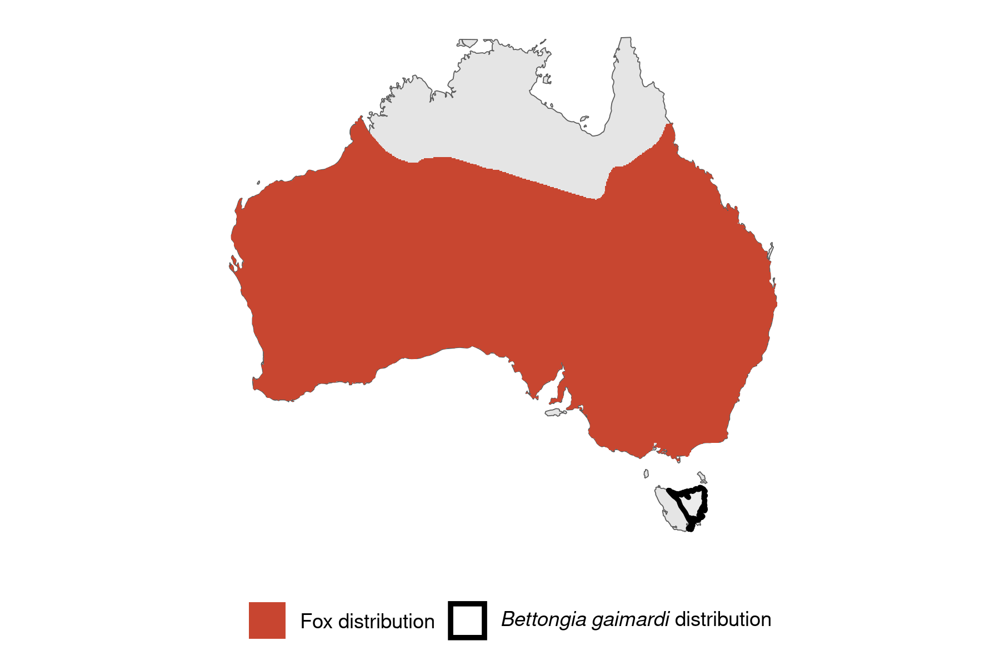

```{css, echo=FALSE}
h1, h2, h3 {
  text-align: center;
}
```

## **Eastern bettong**
### *Bettongia gaimardi*
### Blamed on foxes

:::: {style="display: flex;"}

[](https://www.inaturalist.org/photos/27396353?size=original)

::: {}

:::

::: {}
  ```{r map, echo=FALSE, fig.cap="", out.width = '100%'}
  
  ```
:::

::::
<center>
IUCN status: **Near Threatened**

EPBC Predator Threat Rating: **Not assessed**

IUCN claim: *"The Eastern Bettong is potentially threatened by predation from the Red Fox (Vulpes vulpes) and feral Cat (Felis catus). Historically, the Red Fox has not occurred in Tasmania, but if it were to become established in Tasmania this could be expected to have a major impact on the Eastern Bettong, given the evidence that predation by the Red Fox caused the species' extinction from mainland Australia (Short 1998; Johnson 2006). There is evidence of a recent incursion of the Red Fox, possibly as a result of a deliberate introduction (Sarre et al. 2013)."*

</center>

### Studies in support

The number of bounties paid for Bettongia spp. declined around the same time that fox bounties increased in New South Wales, but it is not known whether bounties reflect abundance and which species were hunted (Short 1998). In a reintroduction study, foxes killed 20 of 46 reintroduced, predator-inexperienced bettongs and survival time was higher in one of two reintroduced groups where bait take was higher (Evans et al. 2021).

### Studies not in support

In a reintroduction study no association was found between fox abundance and reintroduced bettong survival, as bait take and camera detections were not correlated (Evans et al. 2021). Bettongs were last confirmed in Victoria and NSW 37.5 and 22.5 years before to 11.5 and 27.5 years after foxes arrived, respectively (Current submission).

### Is the threat claim evidence-based?

There are no studies evidencing a negative association between foxes and eastern bettong populations. Bounties are not a reliable proxy for abundance (particularly when the species is unidentified); and the fate of reintroduced animals is not a proxy for the fate of populations. It cannot be verified that extirpations occurred after fox arrival.
<br>
<br>

![**Evidence linking *Bettongia gaimardi* to foxes.** **A.** Systematic review of evidence for an association between *Bettongia gaimardi* and foxes. Positive studies are in support of the hypothesis that foxes contribute to the decline of *Bettongia gaimardi*, negative studies are not in support. Predation studies include studies documenting hunting or scavenging; baiting studies are associations between poison baiting and threatened mammal abundance where information on predator abundance is not provided; population studies are associations between threatened mammal and predator abundance. **B.** Last records of extirpated populations relative to earliest local records of foxes. Error bars show record uncertainty range. Predator arrival records were digitized from Fairfax 2019. See methods section in [current submission] for details on evidence categories.](assets/figures/Main_Evidence_Fox_Bettongia gaimardi.png)

### References


Current submission (2023) Scant evidence that introduced predators cause extinctions.

Evans, M.J., Batson, W.G., Gordon, I.J., Belton, E., Chaseling, T., Fletcher, D., Harrison, M., McElroy, T., Mungoven, A., Newport, J. and Pierson, J., 2021. The ‘Goldilocks Zone’of predation: the level of fox control needed to select predator resistance in a reintroduced mammal in Australia. Biodiversity and Conservation, 30, pp.1731-1752.

Fairfax, Dispersal of the introduced red fox (Vulpes vulpes) across Australia. Biol. Invasions 21, 1259-1268 (2019).

IUCN Red List. https://www.iucnredlist.org/ Accessed June 2023

Short, J. 1998. The extinction of rat-kangaroos (Marsupialia: Potoroidae) in New South Wales, Australia. Biological Conservation 86: 365-377.

