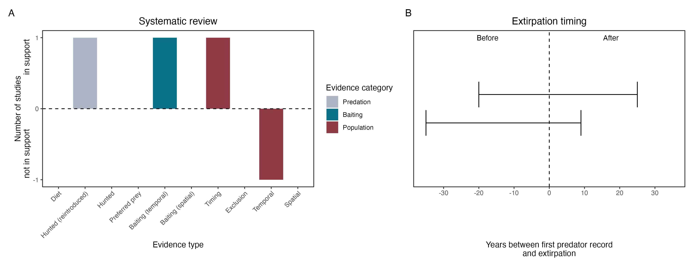

```{css, echo=FALSE}
h1, h2, h3 {
  text-align: center;
}
```

## **Eastern bettong**
### *Bettongia gaimardi*

:::: {style="display: flex;"}

::: {}
  ```{r icon, echo=FALSE, fig.cap="", out.width = '100%'}
  knitr::include_graphics("assets/phylopics/PLACEHOLDER_ready.png")
  ```
:::

::: {}

:::

::: {}
  ```{r map, echo=FALSE, fig.cap="", out.width = '100%'}
  
  ```
:::

::::
<center>
IUCN Status: **Near Threatened**

EPBC Threat Rating: **N/A**

IUCN Claim: *The Eastern Bettong is potentially threatened by predation from the Red Fox (Vulpes vulpes) and feral Cat (Felis catus). Historically, the Red Fox has not occurred in Tasmania, but if it were to become established in Tasmania this could be expected to have a major impact on the Eastern Bettong, given the evidence that predation by the Red Fox caused the species' extinction from mainland Australia (Short 1998; Johnson 2006). There is evidence of a recent incursion of the Red Fox, possibly as a result of a deliberate introduction (Sarre et al. 2013).'*

</center>

### Studies in support

The number of bounties paid for Bettongia spp. declined around the same time that fox bounties increased in New South Wales, but it is not known whether bounties reflect abundance and which species were hunted (Short 1998). In a reintroduction study, foxes killed 20 of 46 reintroduced, predator-inexperienced bettongs and survival time was higher in one of two reintroduced groups where bait take was higher (Evans et al. 2021). Bettongs were last confirmed in NSW 5 years after foxes arrived (Wallach et al. 202X)

### Studies not in support

In a reintroduction study no association was found between fox abundance and reintroduced bettong survival, as bait take and camera detections were not correlated (Evans et al. 2021).

### Is the threat claim evidence-based?

There are no studies evidencing a negative association between foxes and eastern bettong populations. Bounties are not a reliable proxy for abundance (particularly when the species is unidentified); and the fate of reintroduced animals is not a proxy for the fate of populations.
<br>
<br>



### References

Short, J. 1998. The extinction of rat-kangaroos (Marsupialia: Potoroidae) in New South Wales, Australia. Biological Conservation 86: 365-377.

Evans, Maldwyn J., et al. "The ‘goldilocks zone’of predation: The level of fox control needed to select predator resistance in a reintroduced mammal in Australia." Biodiversity and Conservation 30.6 (2021): 1731-1752

Wallach et al. 2023 In Submission

