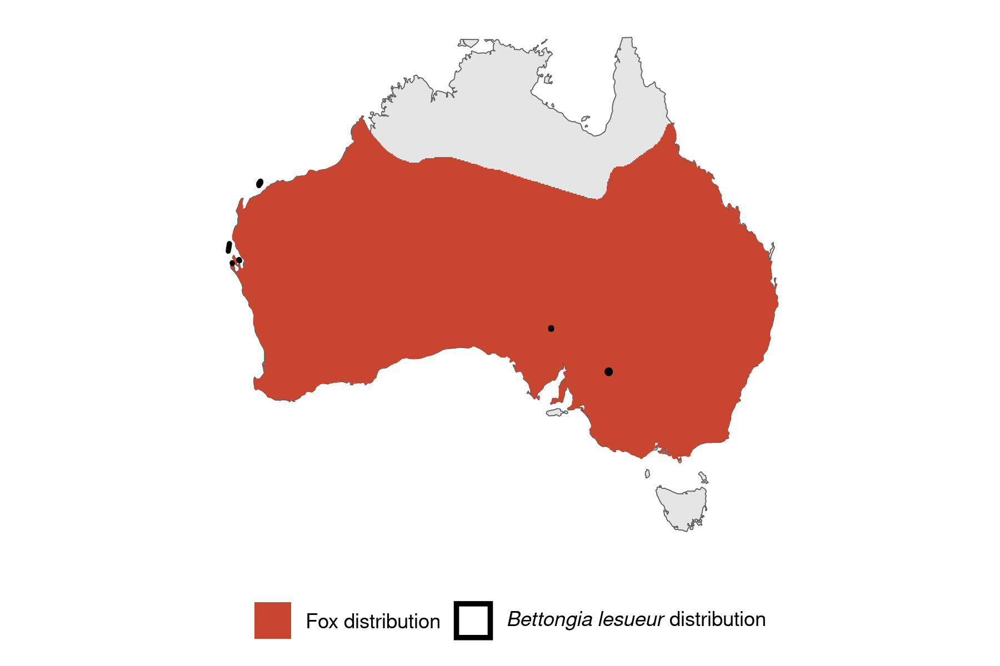

```{css, echo=FALSE}
h1, h2, h3 {
  text-align: center;
}
```

## **Burrowing bettong**
### *Bettongia lesueur*
### Blamed on foxes

:::: {style="display: flex;"}

::: {}
  ```{r icon, echo=FALSE, fig.cap="", out.width = '100%'}
  knitr::include_graphics("assets/phylopics/PLACEHOLDER_ready.png")
  ```
:::

::: {}

:::

::: {}
  ```{r map, echo=FALSE, fig.cap="", out.width = '100%'}
  
  ```
:::

::::
<center>
IUCN Status: **Near Threatened**

EPBC Threat Rating: **Moderate**

IUCN Claim: *"The current major threats to the natural populations of the species include: the accidental introduction of predators (introduced cats and foxes)'"*

</center>

### Studies in support

The number of bounties paid for Bettongia spp. declined around the same time that fox bounties increased in New South Wales, but it is not known whether bounties reflect abundance and which species were hunted (Short 1998). A group of 66 predator-inexperienced bettongs were eliminated from a section of a fenced reserve shortly after a fox breached the fence (Moseby et al. 2019). Foxes were the main predators of predator-inexperienced reintroduced bettongs (Short & Turner 2000). Bettongs were last confirmed in Western Australia 9-16 years after foxes arrived (Wallach et al. 202X).

### Studies not in support

Bettongs were last confirmed in NSW, QLD and Victoria 11-22 years before foxes arrived (Wallach et al. 202X). Foxes were not listed among predators of reintroduced bettongs (Christensen & Burrows 1995).

### Is the threat claim evidence-based?

There are no studies evidencing a negative association between foxes and burrowing bettong populations. Bounties are not a reliable proxy for abundance (particularly when the species is unidentified); and the fate of reintroduced animals is not a proxy for the fate of populations. In contradiction with claim, most bettong extirpation records pre-date fox arrival records.
<br>
<br>

![**Evidence linking *Bettongia lesueur* to foxes.** **A.** Systematic review of evidence for an association between *Bettongia lesueur* and foxes. Positive studies are in support of the hypothesis that foxes contribute to the decline of *Bettongia lesueur*, negative studies are not in support. Predation studies include studies documenting hunting or scavenging; baiting studies are associations between poison baiting and threatened mammal abundance where information on predator abundance is not provided; population studies are associations between threatened mammal and predator abundance. **B.** Last records of extirpated populations relative to earliest local records of foxes. Error bars show record uncertainty range. Predator arrival records were digitized from Fairfax 2019. Small points show unconfirmed records (excluded from analyses).](assets/figures/Main_Evidence_Fox_Bettongia lesueur.png)

### References

Christensen, P., and N. Burrows. "Project desert dreaming: experimental reintroduction of mammals to the Gibson Desert, Western Australia." Reintroduction Biology of Australian and New Zealand Fauna’.(Ed. M. Serena.) pp (1995): 199-207.

Fairfax, Dispersal of the introduced red fox (Vulpes vulpes) across Australia. Biol. Invasions 21, 1259-1268 (2019).

Moseby, Katherine E., et al. "Understanding predator densities for successful co‐existence of alien predators and threatened prey." Austral Ecology 44.3 (2019): 409-419.

Short, J. 1998. The extinction of rat-kangaroos (Marsupialia: Potoroidae) in New South Wales, Australia. Biological Conservation 86: 365-377.

Short, Jeff, and Bruce Turner. "Reintroduction of the burrowing bettong Bettongia lesueur (Marsupialia: Potoroidae) to mainland Australia." Biological Conservation 96.2 (2000): 185-196.

Wallach et al. 2023 In Submission

