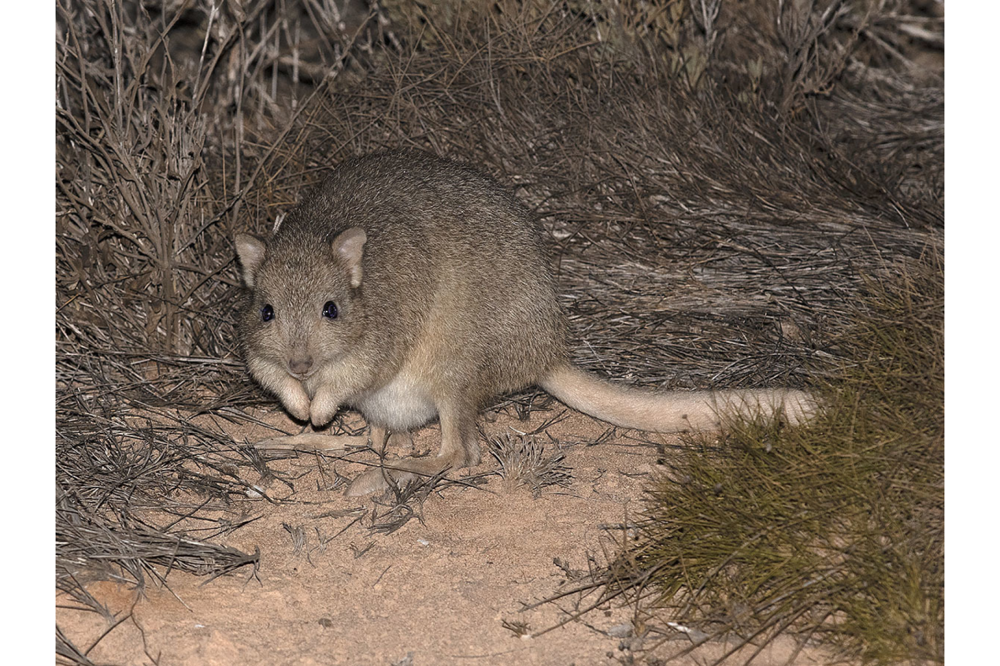

```{css, echo=FALSE}
h1, h2, h3 {
  text-align: center;
}
```

## **Burrowing bettong**
### *Bettongia lesueur*
### Blamed on foxes

:::: {style="display: flex;"}

[](https://www.inaturalist.org/photos/96201616?size=original)

::: {}

:::

::: {}
  ```{r map, echo=FALSE, fig.cap="", out.width = '100%'}
  knitr::include_graphics("assets/figures/Map_Fox_Bettongia lesueur.png")
  ```
:::

::::
<center>
IUCN status: **Near Threatened**

EPBC Predator Threat Rating: **Major**

IUCN claim: *"The current major threats to the natural populations of the species include: the accidental introduction of predators (introduced cats and foxes)"*

</center>

### Studies in support

The number of bounties paid for Bettongia spp. declined around the same time that fox bounties increased in New South Wales, but it is not known whether bounties reflect abundance and which species were hunted (Short 1998). A group of 66 predator-inexperienced bettongs were eliminated from a section of a fenced reserve shortly after a fox breached the fence (Moseby et al. 2019). Foxes were the main predators of predator-inexperienced reintroduced bettongs (Short & Turner 2000). Bettongs were last confirmed in southwest WA and the Nullarbor 4.5-19.5 and 5.5-25.5 years after foxes arrived (Current submission).

### Studies not in support

Foxes were not listed among predators of reintroduced bettongs (Christensen & Burrows 1995). Bettongs were last confirmed in Victoria, Charleville and the Murray-Darling 44.5-4.5, 27.5-17.5 and 51.5-20.5 years before foxes arrived, respectively; and in NSW (two records) and southwest WA 45.5 and 7.5 years before, to 9.5 and 16.5 years after, foxes arrived, respectively (Current submission).

### Is the threat claim evidence-based?

There are no studies evidencing a negative association between foxes and burrowing bettong populations. Bounties are not a reliable proxy for abundance (particularly when the species is unidentified); and the fate of reintroduced animals is not a proxy for the fate of populations. Bettong extirpation records from three regions pre-date fox arrival records, and in two other regions it cannot be verified that extirpations occurred after fox arrival.
<br>
<br>

![**Evidence linking *Bettongia lesueur* to foxes.** **A.** Systematic review of evidence for an association between *Bettongia lesueur* and foxes. Positive studies are in support of the hypothesis that foxes contribute to the decline of *Bettongia lesueur*, negative studies are not in support. Predation studies include studies documenting hunting or scavenging; baiting studies are associations between poison baiting and threatened mammal abundance where information on predator abundance is not provided; population studies are associations between threatened mammal and predator abundance. **B.** Last records of extirpated populations relative to earliest local records of foxes. Error bars show record uncertainty range. Predator arrival records were digitized from Fairfax 2019. Small points show unconfirmed records (excluded from analyses). See methods section in [current submission] for details on evidence categories.](assets/figures/Main_Evidence_Fox_Bettongia lesueur.png)

### References

Christensen, P. and Burrows, N., 1995. Project desert dreaming: experimental reintroduction of mammals to the Gibson Desert, Western Australia. Reintroduction Biology of Australian and New Zealand Fauna’.(Ed. M. Serena.) pp, pp.199-207.

Copley, P., 1999. Natural histories of Australia’s stick-nest rats, genus Leporillus (Rodentia: Muridae). Wildlife Research, 26(4), pp.513-539.

Current submission (2023) Scant evidence that introduced predators cause extinctions.

EPBC. (2013) Threat Abatement Plan for Predation by the European Red Fox (2008). Five yearly review. Environment Protection and Biodiversity Conservation Act 1999, Department of the Environment, Water, Heritage and the Arts, Government of Australia (Appendix E: EPBC Act listed threatened species).

Fairfax, Dispersal of the introduced red fox (Vulpes vulpes) across Australia. Biol. Invasions 21, 1259-1268 (2019).

IUCN Red List. https://www.iucnredlist.org/ Accessed June 2023

Moseby, K.E., Letnic, M., Blumstein, D.T. and West, R., 2019. Understanding predator densities for successful co‐existence of alien predators and threatened prey. Austral Ecology, 44(3), pp.409-419.

Short, J. 1998. The extinction of rat-kangaroos (Marsupialia: Potoroidae) in New South Wales, Australia. Biological Conservation 86: 365-377.

Short, J. and Turner, B., 2000. Reintroduction of the burrowing bettong Bettongia lesueur (Marsupialia: Potoroidae) to mainland Australia. Biological Conservation, 96(2), pp.185-196.

