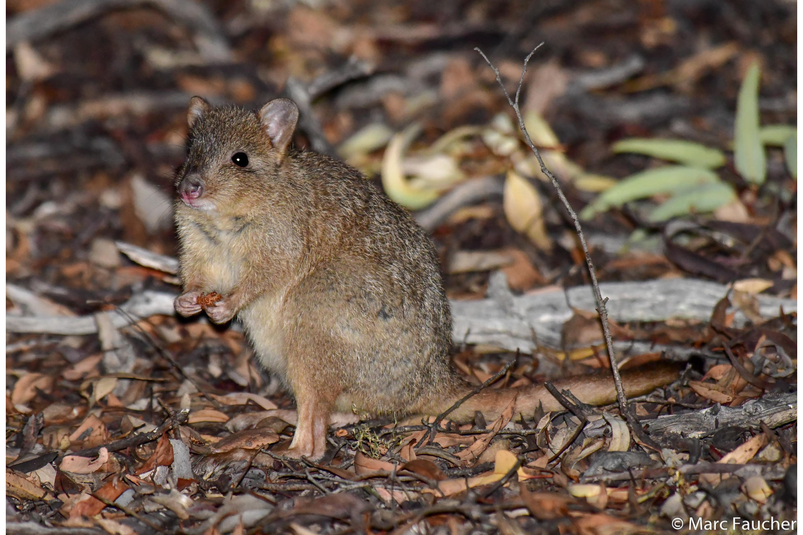
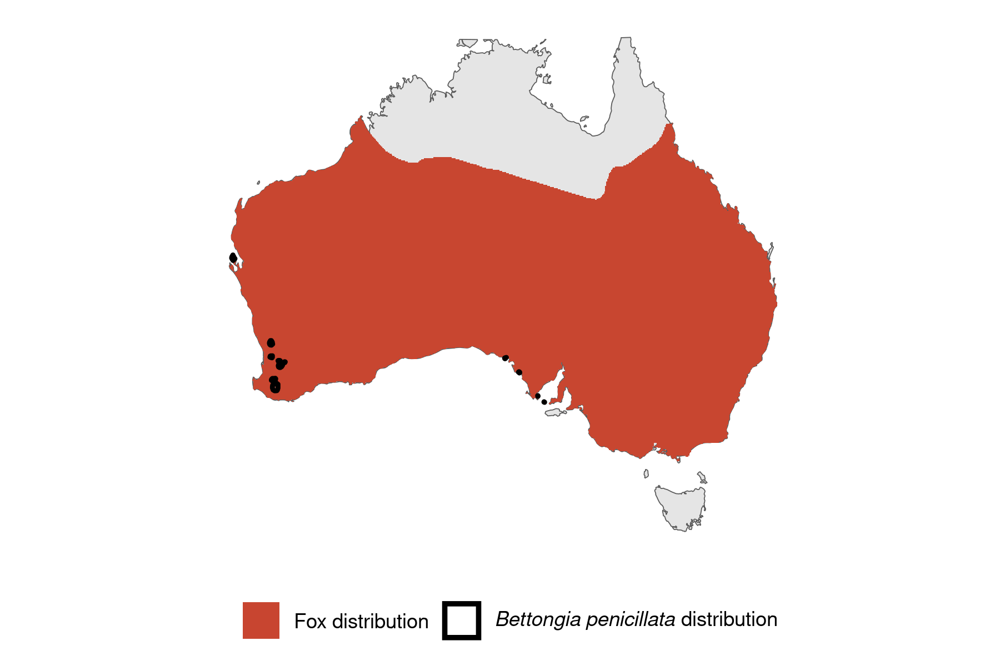

```{css, echo=FALSE}
h1, h2, h3 {
  text-align: center;
}
```

## **Woylie**
### *Bettongia penicillata*
### Blamed on foxes

:::: {style="display: flex;"}

[](https://www.inaturalist.org/photos/30651085?size=original)

::: {}

:::

::: {}
  ```{r map, echo=FALSE, fig.cap="", out.width = '100%'}
  
  ```
:::

::::
<center>
IUCN status: **Critically Endangered**

EPBC Predator Threat Rating: **High/Very High**

IUCN claim: *"The major reason for past decline has been predation by Red Foxes and feral cats"*

</center>

### Studies in support

The number of bounties paid for Bettongia spp. declined around the same time that fox bounties increased in New South Wales, but it is not known whether bounties reflect abundance and which species were hunted (Short 1998). Foxes predated on reintroduced woylies (Marlow et al. 2015). Woylies were detected in a single fox scat among 450 scats analysed from four sites where woylies occurred (Marlow et al. 2014). One study reported higher bettong abundance at poison-baited sites compared to controls but fox abundance was not monitored and sites were not randomly selected (Wayne et al. 2011). Woylies were last confirmed in the Nullarbor 18-33 years after foxes arrived (Current submission).

### Studies not in support

Studies by Kinnear et al. (2002), Orell (2004), Marlow et al. (2015), Yeatman et al. (2016), and Wayne et al. (2017) reported that woylies initially increased after poison-baiting intensification but the population eventually crashed. Wayne et al. (2017) documented that woylies declined and fox abundance increased but no evidence of a correlation was provided (Wayne et al. 2017). Another study reported that increased poison-baiting intensity was positively associated with woylie abundance, however the trend overlapped with zero, foxes were not monitored, and there were no control sites without poisoning (Geary et al. 2023). Foxes were not listed among predators of reintroduced woylies (Priddel & Wheeler 2004, Martin et al. 2006). Woylies were last confirmed in the Murray River and Goodooga 38-33 and 23-18 years before foxes arrived, respectively (Current submission).

### Is the threat claim evidence-based?

No studies were found evidencing a negative association between foxes and woylie populations. Bounties are not a reliable proxy of abundance (particularly when the species is unidentified); the fate of reintroduced animals is not a reliable proxy for the fate of populations; and poison-baiting is not a reliable proxy of fox abundance. In two regions, woylie extirpation records pre-date fox arrival records
<br>
<br>

![**Evidence linking *Bettongia penicillata* to foxes.** **A.** Systematic review of evidence for an association between *Bettongia penicillata* and foxes. Positive studies are in support of the hypothesis that foxes contribute to the decline of *Bettongia penicillata*, negative studies are not in support. Predation studies include studies documenting hunting or scavenging; baiting studies are associations between poison baiting and threatened mammal abundance where information on predator abundance is not provided; population studies are associations between threatened mammal and predator abundance. **B.** Last records of extirpated populations relative to earliest local records of foxes. Error bars show minimum and maximum extinction intervals. Predator arrival records were digitized from Fairfax 2019. Small points show unconfirmed records (excluded from analyses). See methods section in [current submission] for details on evidence categories.](assets/figures/Main_Evidence_Fox_Bettongia penicillata.png)

### References

Current submission (2023) Scant evidence that introduced predators cause extinctions.

EPBC. (2015) Threat Abatement Plan for Predation by Feral Cats. Environment Protection and Biodiversity Conservation Act 1999, Department of Environment, Government of Australia. (Table A1).

Fairfax, Dispersal of the introduced red fox (Vulpes vulpes) across Australia. Biol. Invasions 21, 1259-1268 (2019).

Geary, W.L., Tulloch, A.I., Ritchie, E.G., Doherty, T.S., Nimmo, D.G., Maxwell, M.A. and Wayne, A.F., 2023. Identifying historical and future global change drivers that place species recovery at risk. Global Change Biology, 29(11), pp.2953-2967.

IUCN Red List. https://www.iucnredlist.org/ Accessed June 2023

Kinnear, J.E., Sumner, N.R. and Onus, M.L., 2002. The red fox in Australia—an exotic predator turned biocontrol agent. Biological Conservation, 108(3), pp.335-359.

Marlow, N.J., Thomas, N.D., Williams, A.A., Macmahon, B., Lawson, J., Hitchen, Y., Angus, J. and Berry, O., 2015. Cats (Felis catus) are more abundant and are the dominant predator of woylies (Bettongia penicillata) after sustained fox (Vulpes vulpes) control. Australian Journal of Zoology, 63(1), pp.18-27.

Marlow, N.J., Thomas, N.D., Williams, A.A.E., Macmahon, B. and Lawson, J., 2014. The diet of foxes (Vulpes vulpes) in fragmented Wheatbelt reserves in Western Australia: implications for woylies (Bettongia penicillata) and other native fauna. Conservation Science Western Australia.

Martin, S., Ball, S. and Peeters, P., 2006. Reintroduction of the brush-tailed Bettong (Bettongia penicillata ogilbyi) into Lincoln National Park.Program review from September 1999 to July 2004. Department for Environment and Heritage, Government of South Australia.

Orell, P., 2004. Fauna monitoring and staff training: Western Shield review – February 2003. Conservation Science Western Australia 5(2), 51-95.

Priddel, D. and Wheeler, R., 2004. An experimental translocation of brush-tailed bettongs (Bettongia penicillata) to western New South Wales. Wildlife Research, 31(4), pp.421-432.

Short, J. 1998. The extinction of rat-kangaroos (Marsupialia: Potoroidae) in New South Wales, Australia. Biological Conservation 86: 365-377.

Wayne, A.F., Liddelow, G.L. and Williams, M.R., 2011. FORESTCHECK: terrestrial vertebrate associations with fox control and silviculture in jarrah (Eucalyptus marginata) forest. Australian Forestry, 74(4), pp.336-349.

Wayne, A.F., Maxwell, M.A., Ward, C.G., Wayne, J.C., Vellios, C.V. and Wilson, I.J., 2017. Recoveries and cascading declines of native mammals associated with control of an introduced predator. Journal of Mammalogy, 98(2), pp.489-501.

Yeatman, G.J., Wayne, A.F., Mills, H.R. and Prince, J., 2016. Temporal patterns in the abundance of a critically endangered marsupial relates to disturbance by roads and agriculture. PLoS One, 11(8), p.e0160790.

