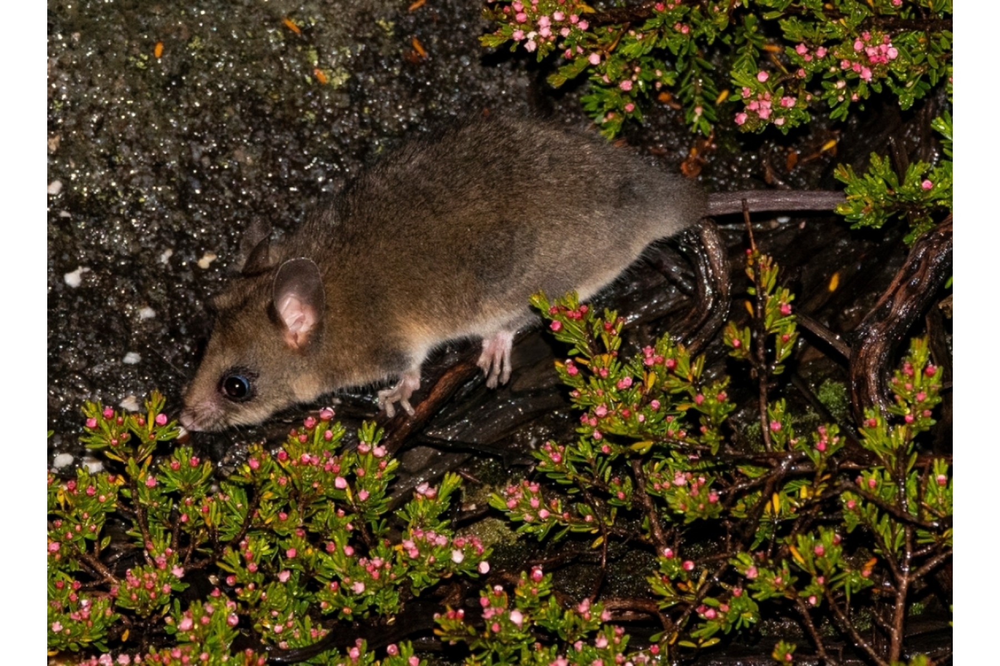

```{css, echo=FALSE}
h1, h2, h3 {
  text-align: center;
}
```

## **Mountain pygmy possum**
### *Burramys parvus*
### Blamed on foxes

:::: {style="display: flex;"}

[](https://www.inaturalist.org/photos/109581343?size=original)

::: {}

:::

::: {}
  ```{r map, echo=FALSE, fig.cap="", out.width = '100%'}
  
  ```
:::

::::
<center>
IUCN status: **Critically Endangered**

EPBC Predator Threat Rating: **Very high**

IUCN claim: *"Predation by the introduced Red Fox is also a threat"*

</center>

### Studies in support

Possums were found in fox scats in three studies (Green & Osborne 1981; Green 2003; Davis et al. 2015).

### Studies not in support

No studies

### Is the threat claim evidence-based?

There are no studies linking foxes to pygmy possum populations.
<br>
<br>

![**Evidence linking *Burramys parvus* to foxes.** Systematic review of evidence for an association between *Burramys parvus* and foxes. Positive studies are in support of the hypothesis that *foxes* contribute to the decline of Burramys parvus, negative studies are not in support. Predation studies include studies documenting hunting or scavenging; baiting studies are associations between poison baiting and threatened mammal abundance where information on predator abundance is not provided; population studies are associations between threatened mammal and predator abundance.](assets/figures/Main_Evidence_Fox_Burramys parvus.png)

### References

Current submission (2023) Scant evidence that introduced predators cause extinctions. Conservation Biology

Davis, N.E., Forsyth, D.M., Triggs, B., Pascoe, C., Benshemesh, J., Robley, A., Lawrence, J., Ritchie, E.G., Nimmo, D.G. and Lumsden, L.F., 2015. Interspecific and geographic variation in the diets of sympatric carnivores: dingoes/wild dogs and red foxes in south-eastern Australia. PloS One, 10(3), p.e0120975.

EPBC. (2015) Threat Abatement Plan for Predation by Feral Cats. Environment Protection and Biodiversity Conservation Act 1999, Department of Environment, Government of Australia. (Table A1).

Green, K. and Osborne, W.S., 1981. The diet of foxes, Vulpes vulpes (L.), in relation to abundance of prey above the winter snowline in New South Wales. Wildlife Research, 8(2), pp.349-360.

Green, K., 2003. Altitudinal and temporal differences in the food of foxes (Vulpes vulpes) at alpine and subalpine altitudes in the Snowy Mountains. Wildlife Research, 30(3), pp.245-253.

IUCN Red List. https://www.iucnredlist.org/ Accessed June 2023

