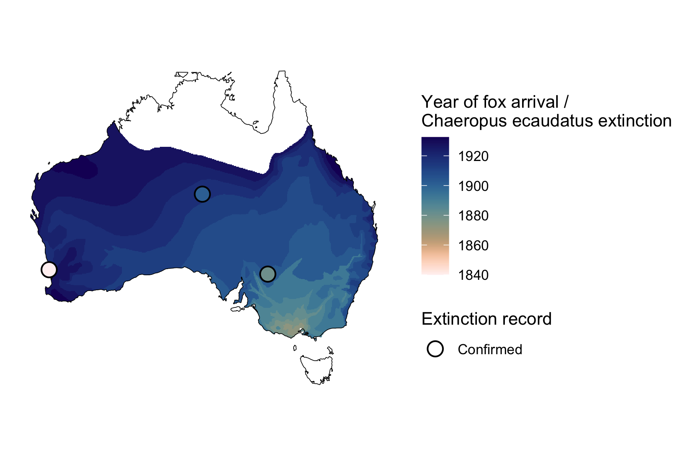
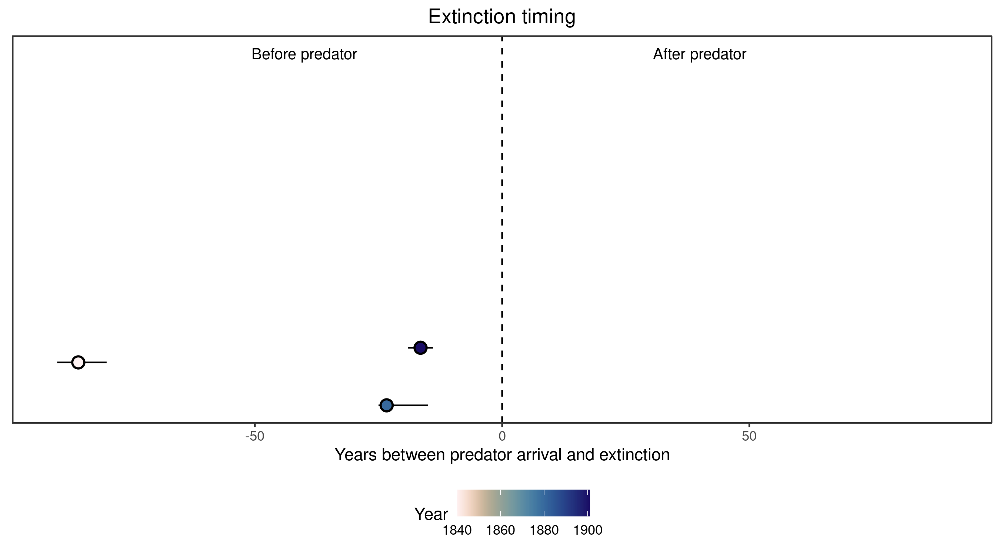

```{css, echo=FALSE}
h1, h2, h3 {
  text-align: center;
}
```

## **Southern pig-footed bandicoot**
### *Chaeropus ecaudatus*
### Blamed on foxes

:::: {style="display: flex;"}

::: {}

[](https://www.inaturalist.org/photos/136746?size=original)

:::

::: {}

:::

::: {}
  ```{r map, echo=FALSE, fig.cap="", out.width = '100%'}
  
  ```
:::

::::

<center>
IUCN status: **Extinct**

Last seen: *Chaeropus ecaudatus were last seen in 1901 in Alice Springs, NT*

</center>


### Studies in support

No studies

### Studies not in support

Southern pig-footed bandicoots were last confirmed in the NT, NSW and WA 17-86 years before foxes arrived (Wallach et al. 202X).

### Is the threat claim evidence-based?

There are no studies evidencing a link between foxes and the extinction of southern pig-footed bandicoots. In contradiction with the claim the extinction record pre-dates the fox arrival record.
<br>
<br>



### References

Fairfax, Dispersal of the introduced red fox (Vulpes vulpes) across Australia. Biol. Invasions 21, 1259-1268 (2019).

Wallach et al. 2023 In Submission

