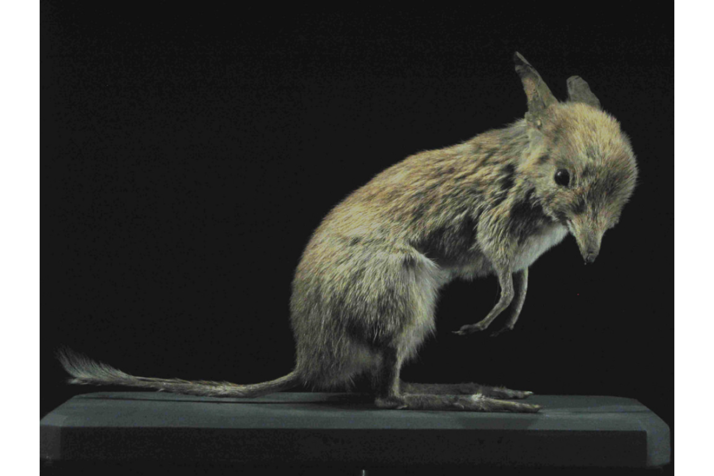
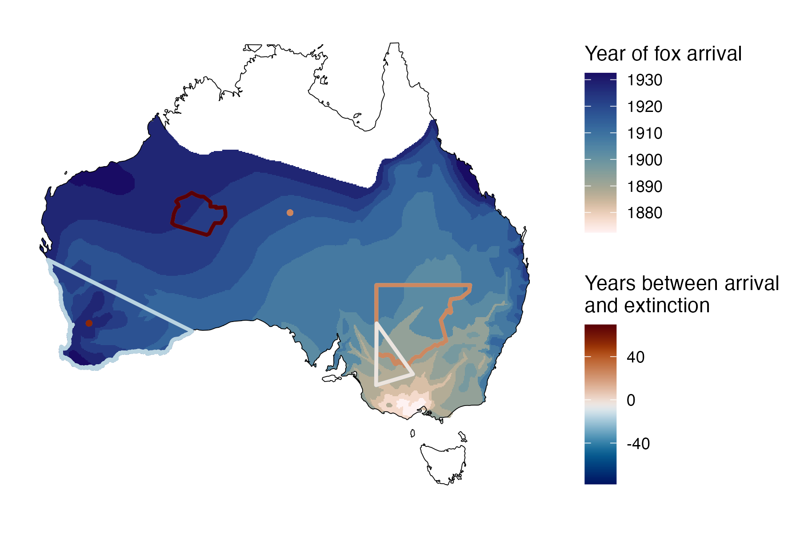
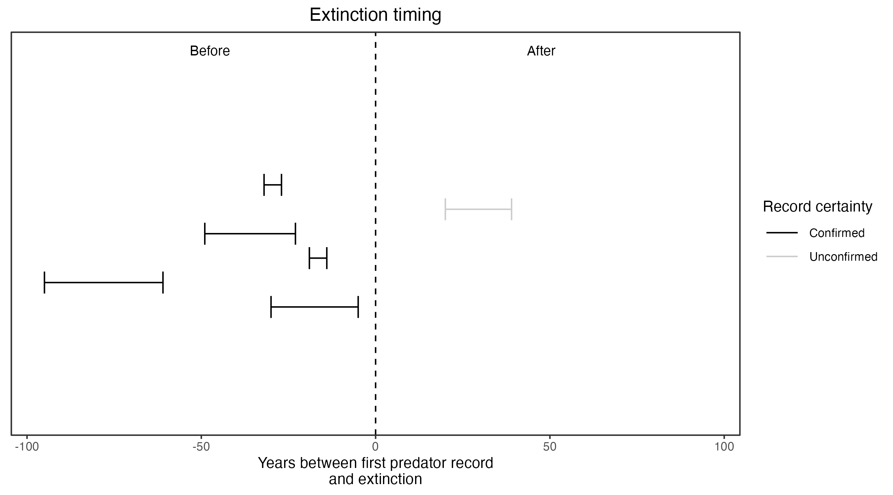

```{css, echo=FALSE}
h1, h2, h3 {
  text-align: center;
}
```

## **Southern pig-footed bandicoot**
### *Chaeropus ecaudatus*
### Blamed on foxes

:::: {style="display: flex;"}

::: {}

[](https://www.inaturalist.org/photos/136746?size=original)

:::

::: {}

:::

::: {}
  ```{r map, echo=FALSE, fig.cap="", out.width = '100%'}
  
  ```
:::

::::

<center>
IUCN status: **Extinct**

Last seen: *Chaeropus ecaudatus were last seen in 1901 in Alice Springs, NT (IUCN 2023)*

IUCN claim: *"The extinction of the Pig-footed Bandicoot is attributed to predation by feral cats and red foxes."*

</center>


### Studies in support

No studies

### Studies not in support

Southern pig-footed bandicoots were last confirmed in the Murray-Darling, Alice Springs, Western Division of NSW, Youndegin, and southwest Australia 49-23, 19-14, 30-5, 32-27, and 95-61 years before foxes arrived, respectively (Wallach et al. 2025).

### Is the threat claim evidence-based?

No studies were found evidencing a link between foxes and the extinction of southern pig-footed bandicoots. All five bandicoot extirpation records pre-date fox arrival records.
<br>
<br>



### References


Fairfax, Dispersal of the introduced red fox (Vulpes vulpes) across Australia. Biol. Invasions 21, 1259-1268 (2019).

IUCN Red List. https://www.iucnredlist.org/ Accessed June 2023

Wallach A.D., Lundgren E.J. (2025) Review of evidence that foxes and cats cause extinctions of Australia’s endemic mammals. BioScience. DOI: 10.1093/biosci/biaf046

