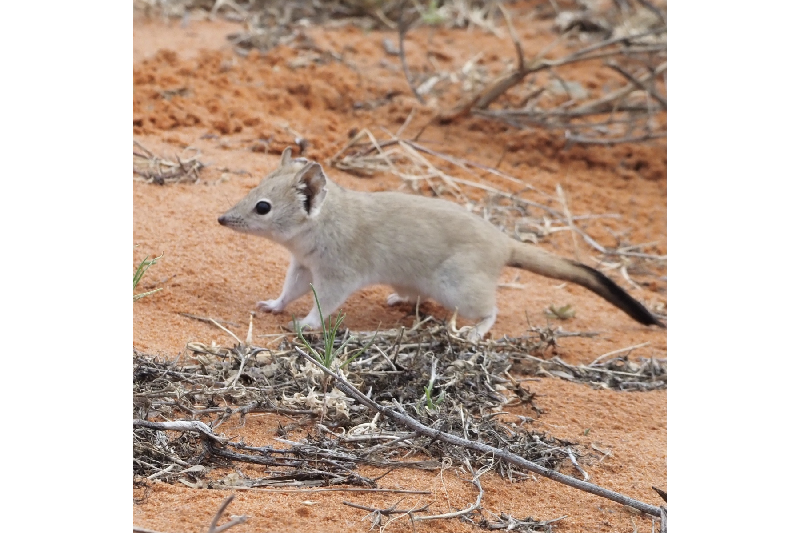

```{css, echo=FALSE}
h1, h2, h3 {
  text-align: center;
}
```

## **Crest-tailed mulgara**
### *Dasycercus cristicauda*
### Blamed on foxes

:::: {style="display: flex;"}

[](https://www.inaturalist.org/photos/138476030?size=original)

::: {}

:::

::: {}
  ```{r map, echo=FALSE, fig.cap="", out.width = '100%'}
  
  ```
:::

::::
<center>
IUCN Status: **Vulnerable**

EPBC Threat Rating: **High**

IUCN Claim: *"Threats are poorly understood but include predation by and competition with feral cats and Red Foxes,'"*

</center>

### Studies in support

Mulgara were found in foxes’ diet (Mahon 1999; Paltridge 2002; Cupples et al. 2011); and mulgara were last confirmed in the Nullarbor 16 years after foxes arrived (Wallach et al. 202X).

### Studies not in support

Mulgara were last confirmed in NSW 4 years before foxes arrived (Wallach et al. 202X).

### Is the threat claim evidence-based?

There are no studies evidencing a negative association between foxes and mulgara populations. In contradiction with the claim, the extirpation record from NSW pre-dates the fox arrival record.
<br>
<br>

![**Evidence linking *Dasycercus cristicauda* to foxes.** **A.** Systematic review of evidence for an association between *Dasycercus cristicauda* and foxes. Positive studies are in support of the hypothesis that foxes contribute to the decline of *Dasycercus cristicauda*, negative studies are not in support. Predation studies include studies documenting hunting or scavenging; baiting studies are associations between poison baiting and threatened mammal abundance where information on predator abundance is not provided; population studies are associations between threatened mammal and predator abundance. **B.** Last records of extirpated populations relative to earliest local records of foxes. Error bars show record uncertainty range. Predator arrival records were digitized from Fairfax 2019.](assets/figures/Main_Evidence_Fox_Dasycercus cristicauda.png)

### References

Fairfax, Dispersal of the introduced red fox (Vulpes vulpes) across Australia. Biol. Invasions 21, 1259-1268 (2019).

Jacqueline B. Cupples, Mathew S. Crowther, Georgeanna Story, Mike Letnic, Dietary overlap and prey selectivity among sympatric carnivores: Could dingoes suppress foxes through competition for prey?, Journal of Mammalogy, Volume 92, Issue 3, 9 June 2011, Pages 590–600, https://doi.org/10.1644/10-MAMM-A-164.1

Mahon, P.S. (1999). Predation by feral cats and red foxes and the dynamics of small mammal populations in arid Australia. (PhD thesis, University of Sydney, Sydney).

Paltridge, Rachel. "The diets of cats, foxes and dingoes in relation to prey availability in the Tanami Desert, Northern Territory." Wildlife Research 29.4 (2002): 389-403

Wallach et al. 2023 In Submission

