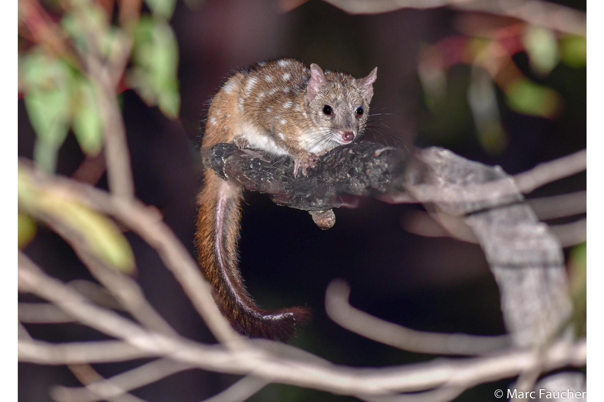
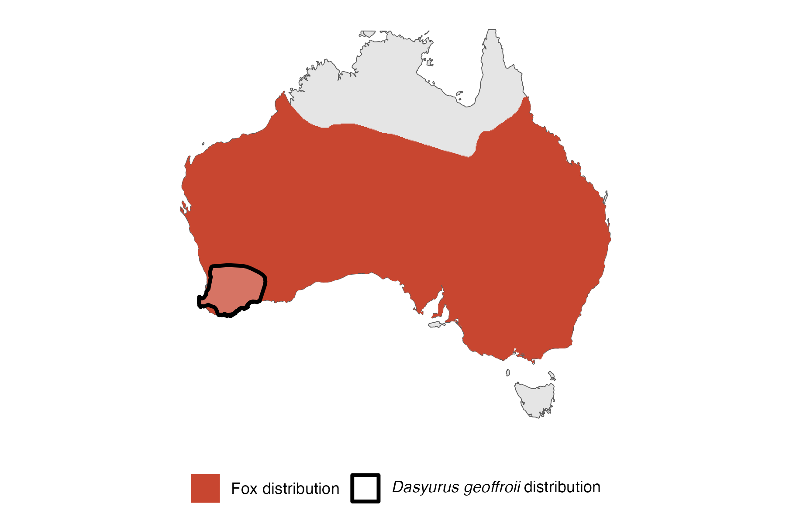

```{css, echo=FALSE}
h1, h2, h3 {
  text-align: center;
}
```

## **Western quoll**
### *Dasyurus geoffroii*
### Blamed on foxes

:::: {style="display: flex;"}

[](https://www.inaturalist.org/photos/30906138?size=original)

::: {}

:::

::: {}
  ```{r map, echo=FALSE, fig.cap="", out.width = '100%'}
  
  ```
:::

::::
<center>
IUCN status: **Near Threatened**

EPBC Predator Threat Rating: **Very high**

IUCN claim: *"Predation by introduced Red Fox and feral Cat are the major threats."*

</center>

### Studies in support

Quoll population increased after poison-baiting was intensified, but no evidence provided the baiting impacted foxes (Morris et al. 2003). Quoll abundance was higher at poison-baited sites compared to controls, though not at statistical significance, fox abundance was not monitored, and sites not selected randomly (Wayne et al. 2011). Quoll population increased and then declined where poison-baiting was conducted, and at one site it was observed but not evidenced that the population increased (Orell 2004; DEC 2012). A translocation failed at a site not intensively poison-baited, and a quoll sighting occurred where poison-baiting was intensive (Kinnear et al. 2002). poison-baiting targeting cats was associated with a decline in foxes, but temporal association with quoll abundance wasn’t analysed and association between fox and quoll abundance was unclear (Comer et al. 2020). Quolls were last confirmed 7 and 26 years after foxes arrived in the Eyre Peninsula and Nullarbor, respectively (Current submission).

### Studies not in support

Increased poison-baiting intensity relative to quoll abundance overlapped with zero, and no data on foxes, nor control sites without poisoning were included (Geary et al. 2023). Foxes were not among predators of translocated quolls (Moseby et al. 2015; Moseby et al. 2021a; Moseby et al. 2021b). Quoll abundance increased and fox abundance also increased but no statistical analysis, control, or other variables were tested for (Wayne et al. 2017). Quolls were last confirmed in NSW 46 years before foxes arrived (Current submission).

### Is the threat claim evidence-based?

There are no studies evidencing a negative association between foxes and western quoll populations. Poison-baiting is not a reliable proxy of fox abundance. In contradiction with the claim, the extirpation record from NSW pre-dates the fox arrival record.
<br>
<br>

![**Evidence linking *Dasyurus geoffroii* to foxes.** **A.** Systematic review of evidence for an association between *Dasyurus geoffroii* and foxes. Positive studies are in support of the hypothesis that foxes contribute to the decline of *Dasyurus geoffroii*, negative studies are not in support. Predation studies include studies documenting hunting or scavenging; baiting studies are associations between poison baiting and threatened mammal abundance where information on predator abundance is not provided; population studies are associations between threatened mammal and predator abundance. **B.** Last records of extirpated populations relative to earliest local records of foxes. Error bars show record uncertainty range. Predator arrival records were digitized from Fairfax 2019. See methods section in [current submission] for details on evidence categories.](assets/figures/Main_Evidence_Fox_Dasyurus geoffroii.png)

### References

Comer, S., Clausen, L., Cowen, S., Pinder, J., Thomas, A., Burbidge, A.H., Tiller, C., Algar, D. and Speldewinde, P., 2020. Integrating feral cat (Felis catus) control into landscape-scale introduced predator management to improve conservation prospects for threatened fauna: a case study from the south coast of Western Australia. Wildlife Research, 47(8), pp.762-778.

Current submission (2023) Scant evidence that introduced predators cause extinctions.

Department of Environment and Conservation, 2012. Chuditch (Dasyurus geoffroii) Recovery Plan. Wildlife Management Program No. 54. Department of Environment and Conservation, Perth, Western Australia.

EPBC. (2015) Threat Abatement Plan for Predation by Feral Cats. Environment Protection and Biodiversity Conservation Act 1999, Department of Environment, Government of Australia. (Table A1).

Fairfax, Dispersal of the introduced red fox (Vulpes vulpes) across Australia. Biol. Invasions 21, 1259-1268 (2019).

Geary, W.L., Tulloch, A.I., Ritchie, E.G., Doherty, T.S., Nimmo, D.G., Maxwell, M.A. and Wayne, A.F., 2023. Identifying historical and future global change drivers that place species recovery at risk. Global Change Biology, 29(11), pp.2953-2967.

IUCN Red List. https://www.iucnredlist.org/ Accessed June 2023

Kinnear, J.E., Sumner, N.R. and Onus, M.L., 2002. The red fox in Australia—an exotic predator turned biocontrol agent. Biological Conservation, 108(3), pp.335-359.

Morris, K., Johnson, B., Orell, P., Gaikhorst, G., Wayne, A. and Moro, D., 2003. Recovery of the threatened chuditch (Dasyurus geoffroii): a case study. Predators With Pouches: The Biology of Carnivorous Marsupials, pp.435-451.

Moseby, K., Hodgens, P., Bannister, H., Mooney, P., Brandle, R., Lynch, C., Young, C., Jansen, J. and Jensen, M., 2021. The ecological costs and benefits of a feral cat poison‐baiting programme for protection of reintroduced populations of the western quoll and brushtail possum. Austral Ecology, 46(8), pp.1366-1382.

Moseby, K.E., Hodgens, P., Peacock, D., Mooney, P., Brandle, R., Lynch, C., West, R., Young, C.M., Bannister, H., Copley, P. and Jensen, M.A., 2021. Intensive monitoring, the key to identifying cat predation as a major threat to native carnivore (Dasyurus geoffroii) reintroduction. Biodiversity and Conservation, 30, pp.1547-1571.

Moseby, K.E., Peacock, D.E. and Read, J.L., 2015. Catastrophic cat predation: a call for predator profiling in wildlife protection programs. Biological Conservation, 191, pp.331-340.

Orell, P., 2004. Fauna monitoring and staff training: Western Shield review – February 2003. Conservation Science Western Australia 5(2), 51-95.

Wayne, A.F., Liddelow, G.L. and Williams, M.R., 2011. FORESTCHECK: terrestrial vertebrate associations with fox control and silviculture in jarrah (Eucalyptus marginata) forest. Australian Forestry, 74(4), pp.336-349.

Wayne, A.F., Maxwell, M.A., Ward, C.G., Wayne, J.C., Vellios, C.V. and Wilson, I.J., 2017. Recoveries and cascading declines of native mammals associated with control of an introduced predator. Journal of Mammalogy, 98(2), pp.489-501.

