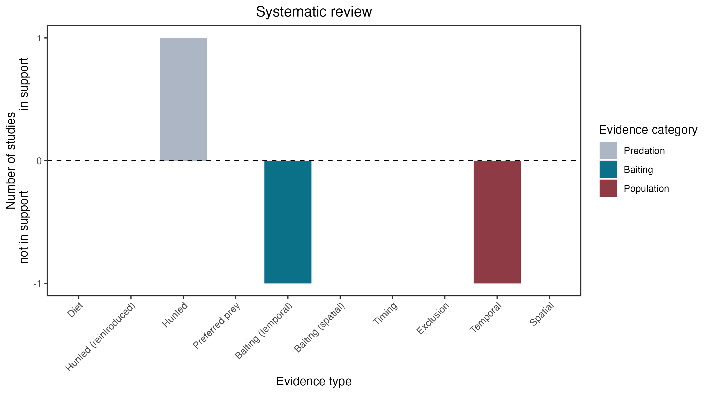

```{css, echo=FALSE}
h1, h2, h3 {
  text-align: center;
}
```

## **Tiger quoll**
### *Dasyurus maculatus*

:::: {style="display: flex;"}

::: {}
  ```{r icon, echo=FALSE, fig.cap="", out.width = '100%'}
  knitr::include_graphics("assets/phylopics/PLACEHOLDER_ready.png")
  ```
:::

::: {}

:::

::: {}
  ```{r map, echo=FALSE, fig.cap="", out.width = '100%'}
  
  ```
:::

::::
<center>
IUCN Status: **Near Threatened**

EPBC Threat Rating: **Very high**

IUCN Claim: *Predation by foxes and dogs'*

</center>

### Studies in support

A fox consumed part of a quoll, possibly scavenged (Körtner et al. 2003).

### Studies not in support

Körtner et al. (2003) found no effect of poison baiting on quoll abundance and no effect on fox abundance in 3 of 4 sites or years.

### Is the threat claim evidence-based?

There are no studies linking foxes to tiger quoll populations.
<br>
<br>



### References

Körtner, Gerhard, Shaan Gresser, and Bob Harden. "Does fox baiting threaten the spotted-tailed quoll, Dasyurus maculatus?." Wildlife Research 30.2 (2003): 111-118.

Wallach et al. 2023 In Submission

