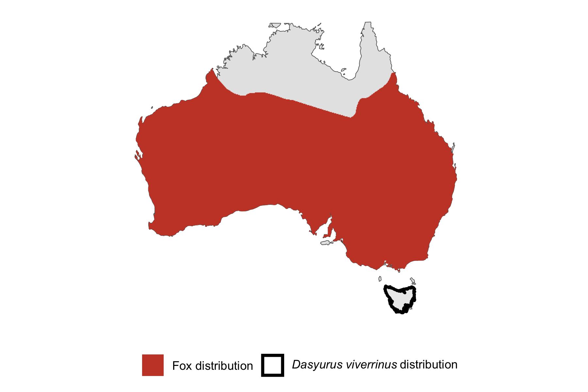

```{css, echo=FALSE}
h1, h2, h3 {
  text-align: center;
}
```

## **Eastern quoll**
### *Dasyurus viverrinus*
### Blamed on foxes

:::: {style="display: flex;"}

[](https://www.inaturalist.org/photos/114390835?size=original)

::: {}

:::

::: {}
  ```{r map, echo=FALSE, fig.cap="", out.width = '100%'}
  
  ```
:::

::::
<center>
IUCN status: **Endangered**

EPBC Predator Threat Rating: **Very high**

IUCN claim: *"predation by introduced feral cats and red foxes"*

</center>

### Studies in support

Foxes or another canid (Canis sp.) were the main predators of a group of captive-raised reintroduced quolls (Peacock & Abbott 2014; Robinson et al. 2020; Robinson et al. 2021). Historical records suggest foxes hunted or scavenged quolls when quolls were abundant (Peacock & Abbott 2014). Quolls were last confirmed in NSW (two records) 48-84 years after foxes arrived (Current submission).

### Studies not in support

No studies

### Is the threat claim evidence-based?

No studies were found linking foxes to eastern quoll population trends.
<br>
<br>

![**Evidence linking *Dasyurus viverrinus* to foxes.** **A.** Systematic review of evidence for an association between *Dasyurus viverrinus* and foxes. Positive studies are in support of the hypothesis that foxes contribute to the decline of *Dasyurus viverrinus*, negative studies are not in support. Predation studies include studies documenting hunting or scavenging; baiting studies are associations between poison baiting and threatened mammal abundance where information on predator abundance is not provided; population studies are associations between threatened mammal and predator abundance. **B.** Last records of extirpated populations relative to earliest local records of foxes. Error bars show minimum and maximum extinction intervals. Predator arrival records were digitized from Fairfax 2019. Small points show unconfirmed records (excluded from analyses). See methods section in [current submission] for details on evidence categories.](assets/figures/Main_Evidence_Fox_Dasyurus viverrinus.png)

### References

Current submission (2023) Scant evidence that introduced predators cause extinctions.

EPBC. (2015) Threat Abatement Plan for Predation by Feral Cats. Environment Protection and Biodiversity Conservation Act 1999, Department of Environment, Government of Australia. (Table A1).

Fairfax, Dispersal of the introduced red fox (Vulpes vulpes) across Australia. Biol. Invasions 21, 1259-1268 (2019).

IUCN Red List. https://www.iucnredlist.org/ Accessed June 2023

Peacock D, Abbott I. 2014. When the ‘native cat’would ‘plague’: historical hyperabundance in the quoll (Marsupialia: Dasyuridae) and an assessment of the role of disease, cats and foxes in its curtailment. Australian Journal of Zoology 62:294-344.

Robinson NM, Blanchard W, MacGregor C, Brewster R, Dexter N, Lindenmayer DB. 2021. Can evolutionary theories of dispersal and senescence predict postrelease survival, dispersal, and body condition of a reintroduced threatened mammal? Ecol Evol;11:1002– 1012

Robinson, N.M., Dexter, N., Brewster, R., Maple, D., MacGregor, C., Rose, K., Hall, J. and Lindenmayer, D.B., 2020. Be nimble with threat mitigation: lessons learned from the reintroduction of an endangered species. Restoration Ecology, 28(1), pp.29-38.

