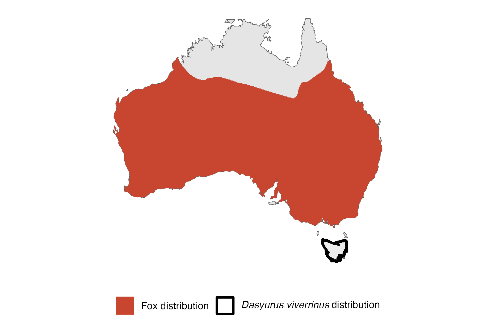
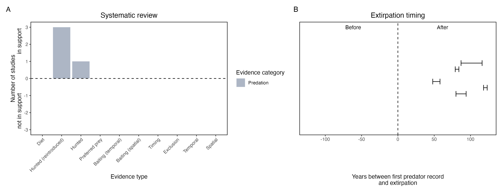

```{css, echo=FALSE}
h1, h2, h3 {
  text-align: center;
}
```

## **Eastern quoll**
### *Dasyurus viverrinus*

:::: {style="display: flex;"}

::: {}
  ```{r icon, echo=FALSE, fig.cap="", out.width = '100%'}
  knitr::include_graphics("assets/phylopics/PLACEHOLDER_ready.png")
  ```
:::

::: {}

:::

::: {}
  ```{r map, echo=FALSE, fig.cap="", out.width = '100%'}
  
  ```
:::

::::
<center>
IUCN Status: **Endangered**

EPBC Threat Rating: **Very high**

IUCN Claim: *predation by introduced feral cats and red foxes'*

</center>

### Studies in support

Foxes or another canid (Canis sp.) were the main predators of a group of captive-raised reintroduced quolls (Robinson et al. 2020; Robinson et al. 2021). Historical records suggest foxes hunted or scavenged quolls when quolls were abundant (Peacock & Abbott 2014). Quolls were last confirmed in NSW 54 years after foxes arrived (Wallach et al. 202X).

### Studies not in support

No studies

### Is the threat claim evidence-based?

There are no studies linking foxes to eastern quoll populations.
<br>
<br>



### References

Robinson NM, Blanchard W, MacGregor C, Brewster R, Dexter N, Lindenmayer DB. Can evolutionary theories of dispersal and senescence predict postrelease survival, dispersal, and body condition of a reintroduced threatened mammal? Ecol Evol. 2021;11:1002– 1012

Robinson, Natasha M., et al. "Be nimble with threat mitigation: lessons learned from the reintroduction of an endangered species." Restoration Ecology 28.1 (2020): 29-38

Peacock D, Abbott I. 2014. When the ‘native cat’would ‘plague’: historical hyperabundance in the quoll (Marsupialia: Dasyuridae) and an assessment of the role of disease, cats and foxes in its curtailment. Australian Journal of Zoology 62:294-344.

Wallach et al. 2023 In Submission

