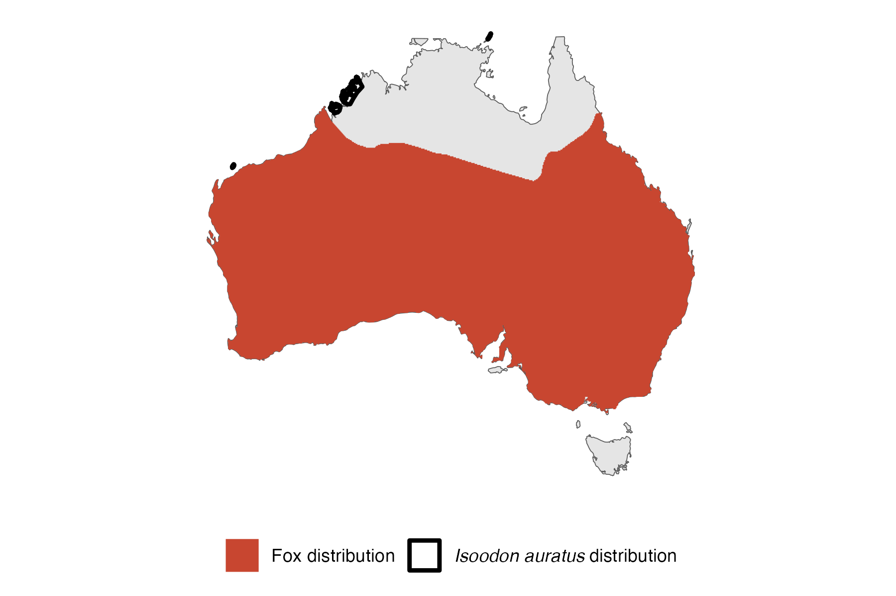

```{css, echo=FALSE}
h1, h2, h3 {
  text-align: center;
}
```

## **Golden bandicoot**
### *Isoodon auratus*
### Blamed on foxes

:::: {style="display: flex;"}

[](https://www.inaturalist.org/photos/6235137?size=original)

::: {}

:::

::: {}
  ```{r map, echo=FALSE, fig.cap="", out.width = '100%'}
  
  ```
:::

::::
<center>
IUCN status: **Vulnerable**

EPBC Predator Threat Rating: **Not assessed**

IUCN claim: *"The reasons for past declines of the Golden Bandicoot are predation by feral cats and red foxes"*

</center>

### Studies in support

Bandicoots were last confirmed in the Nullarbor and Canning Stock Route 2-17 and 0-6 years after foxes arrived (Current submission).

### Studies not in support

Foxes were not among predators of reintroduced bandicoots (Christensen & Burrows 1995; Blythman et al. 2020). Bandicoots were last confirmed in western NSW (two records) 53-20 years before foxes arrived, respectively (Current submission).

### Is the threat claim evidence-based?

There are no studies linking foxes to golden bandicoots. Extirpation records predate fox arrival records in one region.
<br>
<br>

![**Evidence linking *Isoodon auratus* to foxes.** **A.** Systematic review of evidence for an association between *Isoodon auratus* and foxes. Positive studies are in support of the hypothesis that foxes contribute to the decline of *Isoodon auratus*, negative studies are not in support. Predation studies include studies documenting hunting or scavenging; baiting studies are associations between poison baiting and threatened mammal abundance where information on predator abundance is not provided; population studies are associations between threatened mammal and predator abundance. **B.** Last records of extirpated populations relative to earliest local records of foxes. Error bars show minimum and maximum extinction intervals. Predator arrival records were digitized from Fairfax 2019. See methods section in [current submission] for details on evidence categories.](assets/figures/Main_Evidence_Fox_Isoodon auratus.png)

### References


Blythman, M., Lohr, C., Sims, C. and Morris, K., 2020. Translocation of Golden Bandicoots, Isoodon auratus barrowensis, from a fenced enclosure to unfenced managed land on Matuwa (formally Lorna Glen) September 2015: Final Report. Department of Biodiversity Conservation and Attractions, Perth Western Australia, 43.

Christensen, P. and Burrows, N., 1995. Project desert dreaming: experimental reintroduction of mammals to the Gibson Desert, Western Australia. Reintroduction Biology of Australian and New Zealand Fauna’.(Ed. M. Serena.) pp, pp.199-207.

Current submission (2023) Scant evidence that introduced predators cause extinctions.

Fairfax, Dispersal of the introduced red fox (Vulpes vulpes) across Australia. Biol. Invasions 21, 1259-1268 (2019).

IUCN Red List. https://www.iucnredlist.org/ Accessed June 2023

