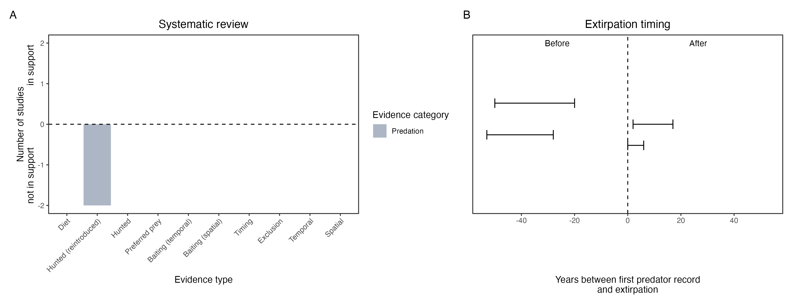

```{css, echo=FALSE}
h1, h2, h3 {
  text-align: center;
}
```

## **Golden bandicoot**
### *Isoodon auratus*
### Blamed on foxes

:::: {style="display: flex;"}

::: {}
  ```{r icon, echo=FALSE, fig.cap="", out.width = '100%'}
  knitr::include_graphics("assets/phylopics/PLACEHOLDER_ready.png")
  ```
:::

::: {}

:::

::: {}
  ```{r map, echo=FALSE, fig.cap="", out.width = '100%'}
  knitr::include_graphics("assets/figures/Map_Fox_Isoodon auratus.png")
  ```
:::

::::
<center>
IUCN Status: **Vulnerable**

EPBC Threat Rating: **N/A**

IUCN Claim: *'The reasons for past declines of the Golden Bandicoot are predation by feral cats and red foxes''*

</center>

### Studies in support

Bandicoots were last confirmed in the Nullarbor 10 years after foxes arrived (Wallach et al. 202X).

### Studies not in support

Foxes were not among predators of reintroduced bandicoots (Christensen & Burrows 1995). Bandicoots were last confirmed in NSW 46 years before foxes arrived (Wallach et al. 202X).

### Is the threat claim evidence-based?

There are no studies linking foxes to golden bandicoots. In contradiction with the claim, the extirpation records from NSW predates the fox arrival record.
<br>
<br>



### References

Christensen, P., and N. Burrows. "Project desert dreaming: experimental reintroduction of mammals to the Gibson Desert, Western Australia." Reintroduction Biology of Australian and New Zealand Fauna’.(Ed. M. Serena.) pp (1995): 199-207.

Blythman, Mark, et al. "Translocation of golden bandicoots, Isoodon auratus barrowensis, from a fenced enclosure to unfenced managed land on Matuwa (formally Lorna Glen) in September 2015." (2020)

Wallach et al. 2023 In Submission

