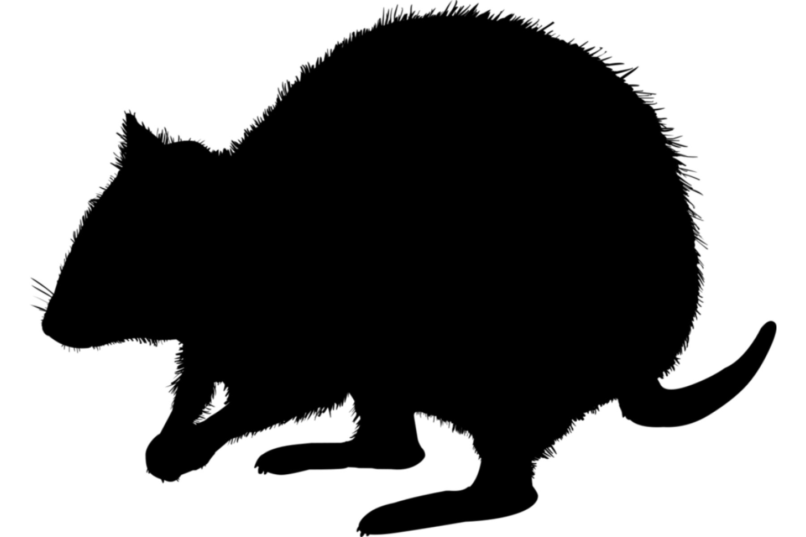

```{css, echo=FALSE}
h1, h2, h3 {
  text-align: center;
}
```

## **Lake Mackay hare-wallaby**
### *Lagorchestes asomatus*
### Blamed on foxes

:::: {style="display: flex;"}

::: {}



:::

::: {}

:::

::: {}
  ```{r map, echo=FALSE, fig.cap="", out.width = '100%'}
  knitr::include_graphics("assets/figures/Map_Fox_Lagorchestes asomatus.png")
  ```
:::

::::

<center>
IUCN status: **Extinct**

Last seen: *Lagorchestes asomatus were last seen in 1932 between Mt Farewell and Lake Mackay, Northern Territory (IUCN 2023)*

IUCN claim: *"Major factors contributing to extinction are considered to be predation by introduced feral cats and red foxes"*

</center>


### Studies in support

Lake Mackay hare-wallabies were last confirmed 7-12 years after foxes arrived (Current submission).

### Studies not in support

No studies

### Is the threat claim evidence-based?

No studies were found evidencing a link between foxes and the extinction of Lake Mackay hare-wallabies.
<br>
<br>


### References


Current submission (2023) Scant evidence that introduced predators cause extinctions.

Fairfax, Dispersal of the introduced red fox (Vulpes vulpes) across Australia. Biol. Invasions 21, 1259-1268 (2019).

IUCN Red List. https://www.iucnredlist.org/ Accessed June 2023

