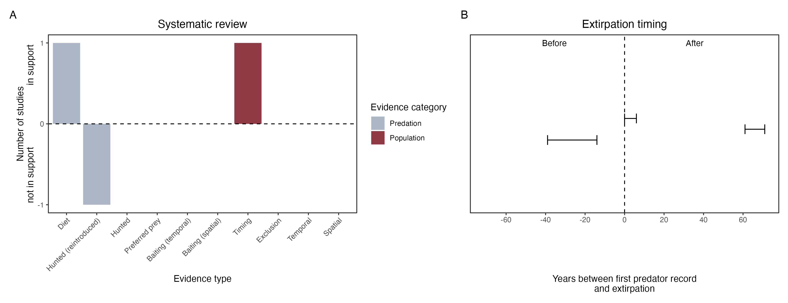

```{css, echo=FALSE}
h1, h2, h3 {
  text-align: center;
}
```

## **Rufous hare-wallaby**
### *Lagorchestes hirsutus*

:::: {style="display: flex;"}

::: {}
  ```{r icon, echo=FALSE, fig.cap="", out.width = '100%'}
  knitr::include_graphics("assets/phylopics/PLACEHOLDER_ready.png")
  ```
:::

::: {}

:::

::: {}
  ```{r map, echo=FALSE, fig.cap="", out.width = '100%'}
  knitr::include_graphics("assets/figures/Map_Fox_Lagorchestes hirsutus.png")
  ```
:::

::::
<center>
IUCN Status: **Vulnerable**

EPBC Threat Rating: **Extreme**

IUCN Claim: *On the mainland, predation by introduced feral Cat and Red Foxes was the major cause of extinction in the wild'*

</center>

### Studies in support

The tracks of a fox were detected for the first time around the time signs of a local wallaby population disappeared (Lundie-Jenkins et al. 1993). Hare-wallaby was found in a fox scat (Lundie-Jenkins et al. 1993). Hare-wallabies were last confirmed in the Tanami Desert 63 years after foxes arrived (Wallach et al. 202X).

### Studies not in support

Foxes were not among predators of reintroduced hare-wallabies (Gibson et al. 1994). Hare-wallabies were last confirmed in south-west Australia 30 years before foxes arrived (Wallach et al. 202X).

### Is the threat claim evidence-based?

There are no studies evidencing a negative association between foxes and rufous hare-wallaby population that has been tested statistically. In contradiction with the claim, the extirpation record from south-west Australia pre-dates the fox arrival record, and the the two species co-occurred in one locale for over half-a-century.
<br>
<br>



### References

Lundie-Jenkins, G; Corbett, LK; Phillips, CM (1993). Ecology of the rufous hare-wallaby, Lagorchestes hirsutus Gould (Marsupialia : Macropodidae) in the Tanami Desert, Northern Territory. III Interactions with introduced mammal species.. Wildlife Research, 20(4), 495–. doi:10.1071/WR9930495 

Gibson, D.F., Lundie-Jenkins, J., Langford, D., Cole, J.R. & Johnson, K.A. (1994) Predation by feral cats, Felis catus, on the rufous hare-wallaby, Lagorchestes hirsutus,

Wallach et al. 2023 In Submission

