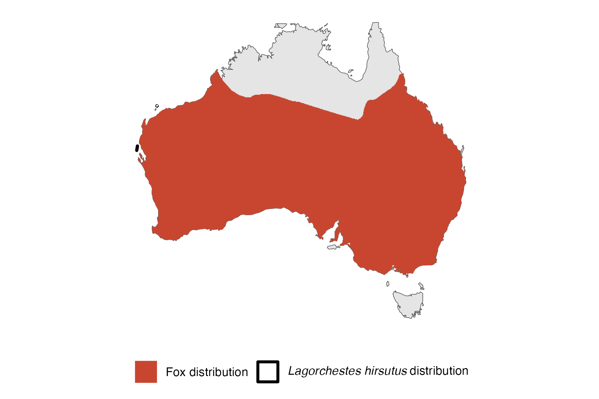

```{css, echo=FALSE}
h1, h2, h3 {
  text-align: center;
}
```

## **Rufous hare-wallaby**
### *Lagorchestes hirsutus*
### Blamed on foxes

:::: {style="display: flex;"}

[](https://www.inaturalist.org/photos/60046491?size=original)

::: {}

:::

::: {}
  ```{r map, echo=FALSE, fig.cap="", out.width = '100%'}
  
  ```
:::

::::
<center>
IUCN status: **Vulnerable**

EPBC Predator Threat Rating: **Extreme**

IUCN claim: *"On the mainland, predation by introduced feral Cat and Red Foxes was the major cause of extinction in the wild"*

</center>

### Studies in support

The tracks of a fox were detected for the first time around the time signs of a local wallaby population disappeared (Lundie-Jenkins et al. 1993). Hare-wallaby was found in a fox scat (Lundie-Jenkins et al. 1993). Hare-wallabies were last confirmed in the Tanami Desert and Canning Stock Route 61-71 and 0-6 years after foxes arrived (Current submission).

### Studies not in support

Foxes were not among predators of reintroduced hare-wallabies (Gibson et al. 1994). Hare-wallabies were last confirmed in southwest Australia 39-14 years before foxes arrived (Current submission).

### Is the threat claim evidence-based?

No studies were found evidencing a negative association between foxes and rufous hare-wallaby population that has been tested statistically. In one region wallaby extirpation records pre-date fox arrival records.
<br>
<br>

![**Evidence linking *Lagorchestes hirsutus* to foxes.** **A.** Systematic review of evidence for an association between *Lagorchestes hirsutus* and foxes. Positive studies are in support of the hypothesis that foxes contribute to the decline of *Lagorchestes hirsutus*, negative studies are not in support. Predation studies include studies documenting hunting or scavenging; baiting studies are associations between poison baiting and threatened mammal abundance where information on predator abundance is not provided; population studies are associations between threatened mammal and predator abundance. **B.** Last records of extirpated populations relative to earliest local records of foxes. Error bars show minimum and maximum extinction intervals. Predator arrival records were digitized from Fairfax 2019. See methods section in [current submission] for details on evidence categories.](assets/figures/Main_Evidence_Fox_Lagorchestes hirsutus.png)

### References

Current submission (2023) Scant evidence that introduced predators cause extinctions.

EPBC. (2015) Threat Abatement Plan for Predation by Feral Cats. Environment Protection and Biodiversity Conservation Act 1999, Department of Environment, Government of Australia. (Table A1).

Fairfax, Dispersal of the introduced red fox (Vulpes vulpes) across Australia. Biol. Invasions 21, 1259-1268 (2019).

Gibson, D.F., Lundie-Jenkins, G., Langford, D.G., Cole, J.R. and Johnson, K.A., 1994. Predation by feral cats, Felis catus, on the rufous hare-wallaby, Lagorchestes hirsutus, in the Tanami Desert. Australian Mammalogy, 17(1), pp.103-107.

IUCN Red List. https://www.iucnredlist.org/ Accessed June 2023

Lundie-Jenkins, G., Corbett, L.K., Phillips, C.M. 1993. Ecology of the rufous hare-wallaby, Lagorchestes hirsutus Gould (Marsupialia : Macropodidae) in the Tanami Desert, Northern Territory. III Interactions with introduced mammal species. Wildlife Research, 20(4), pp 495-511.

