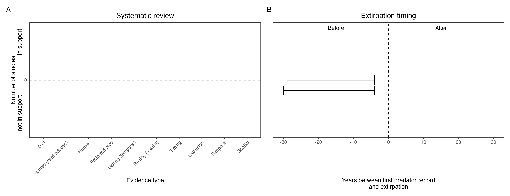

```{css, echo=FALSE}
h1, h2, h3 {
  text-align: center;
}
```

## **Banded hare-wallaby**
### *Lagostrophus fasciatus*
### Blamed on foxes

:::: {style="display: flex;"}

::: {}
  ```{r icon, echo=FALSE, fig.cap="", out.width = '100%'}
  knitr::include_graphics("assets/phylopics/PLACEHOLDER_ready.png")
  ```
:::

::: {}

:::

::: {}
  ```{r map, echo=FALSE, fig.cap="", out.width = '100%'}
  knitr::include_graphics("assets/figures/Map_Fox_Lagostrophus fasciatus.png")
  ```
:::

::::
<center>
IUCN Status: **Vulnerable**

EPBC Threat Rating: **Moderate**

IUCN Claim: *'The species presumably was extirpated from mainland Australia by a combination of predation by the Red Fox and feral cat and habitat disturbance.''*

</center>

### Studies in support

No studies

### Studies not in support

Hare-wallabies were last confirmed on the mainland in Western Australia 17-20 years before foxes arrived (Wallach et al. 202X).

### Is the threat claim evidence-based?

There are no studies linking foxes to banded hare-wallabies. In contradiction with the claim, the exirpation record pre-dates the fox arrival record.
<br>
<br>



### References


Wallach et al. 2023 In Submission

