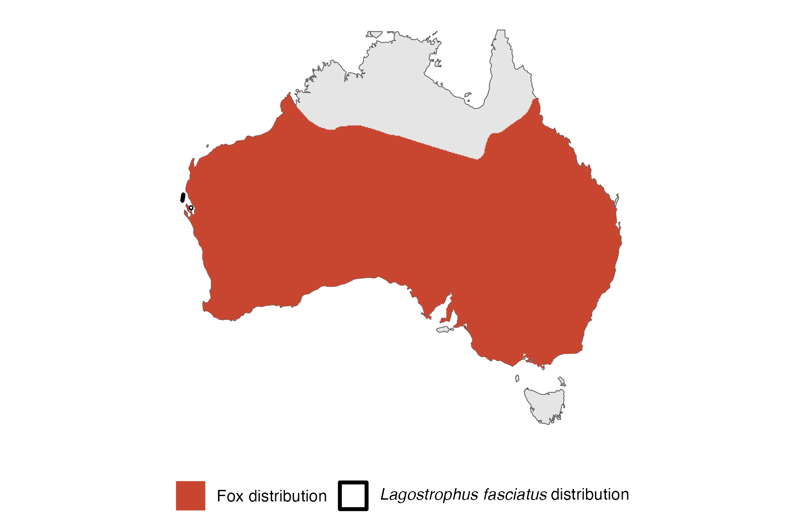

```{css, echo=FALSE}
h1, h2, h3 {
  text-align: center;
}
```

## **Banded hare-wallaby**
### *Lagostrophus fasciatus*
### Blamed on foxes

:::: {style="display: flex;"}

[](https://www.inaturalist.org/photos/96201735?size=original)

::: {}

:::

::: {}
  ```{r map, echo=FALSE, fig.cap="", out.width = '100%'}
  
  ```
:::

::::
<center>
IUCN Status: **Vulnerable**

EPBC Threat Rating: **Moderate**

IUCN Claim: *"The species presumably was extirpated from mainland Australia by a combination of predation by the Red Fox and feral cat and habitat disturbance.'"*

</center>

### Studies in support

No studies

### Studies not in support

Hare-wallabies were last confirmed on the mainland in Western Australia 17-20 years before foxes arrived (Wallach et al. 202X).

### Is the threat claim evidence-based?

There are no studies linking foxes to banded hare-wallabies. In contradiction with the claim, the exirpation record pre-dates the fox arrival record.
<br>
<br>

![**Evidence linking *Lagostrophus fasciatus* to foxes.** **A.** Systematic review of evidence for an association between *Lagostrophus fasciatus* and foxes. Positive studies are in support of the hypothesis that foxes contribute to the decline of *Lagostrophus fasciatus*, negative studies are not in support. Predation studies include studies documenting hunting or scavenging; baiting studies are associations between poison baiting and threatened mammal abundance where information on predator abundance is not provided; population studies are associations between threatened mammal and predator abundance. **B.** Last records of extirpated populations relative to earliest local records of foxes. Error bars show record uncertainty range. Predator arrival records were digitized from Fairfax 2019.](assets/figures/Main_Evidence_Fox_Lagostrophus fasciatus.png)

### References


Fairfax, Dispersal of the introduced red fox (Vulpes vulpes) across Australia. Biol. Invasions 21, 1259-1268 (2019).

Wallach et al. 2023 In Submission

