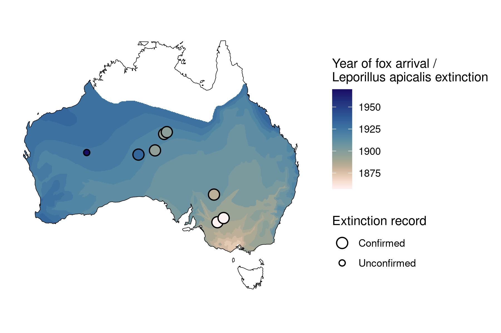

```{css, echo=FALSE}
h1, h2, h3 {
  text-align: center;
}
```

## **Lesser stick-nest rat**
### *Leporillus apicalis*

:::: {style="display: flex;"}

::: {}
  ```{r icon, echo=FALSE, fig.cap="", out.width = '100%'}
  knitr::include_graphics("assets/phylopics/PLACEHOLDER_ready.png")
  ```
:::

::: {}

:::

::: {}
  ```{r map, echo=FALSE, fig.cap="", out.width = '100%'}
  
  ```
:::

::::

<center>
IUCN Status: **Extinct**

Last Seen: *Leporillus apicalis were last seen in 1933 in Norman Tindale, near Mt Crombie, south of the Musgrave Ranges in north-western South Australia*

</center>


### Studies in support

Lesser stick-nest rats were last confirmed in SA 16 years after foxes arrived (Wallach et al. 202X).

### Studies not in support

Lesser stick-nest rats were last confirmed in the NT, NSW and Victoria 17-36 years before foxes arrived (Wallach et al. 202X).

### Is the threat claim evidence-based?

There are no studies evidencing a link between foxes and the extinction of lesser stick-nest rats. In contradiction with the claim, most extinction records pre-date the fox arrival record.
<br>
<br>


### References

Wallach et al. 2023 In Submission

