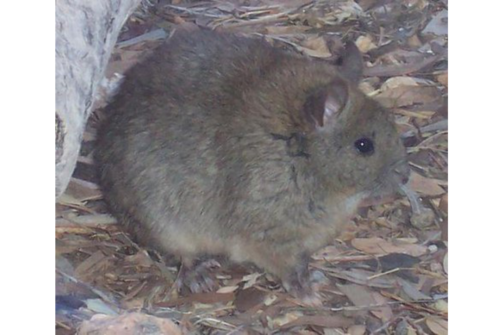
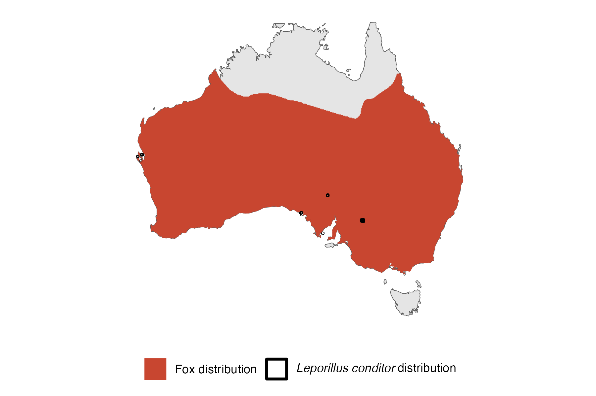

```{css, echo=FALSE}
h1, h2, h3 {
  text-align: center;
}
```

## **Greater stick-nest rat**
### *Leporillus conditor*
### Blamed on foxes

:::: {style="display: flex;"}

[](https://www.inaturalist.org/photos/470262?size=original)

::: {}

:::

::: {}
  ```{r map, echo=FALSE, fig.cap="", out.width = '100%'}
  
  ```
:::

::::
<center>
IUCN status: **Near Threatened**

EPBC Predator Threat Rating: **Moderate**

IUCN claim: *"The major threat for L. conditor is predation by feral cats and red foxes."*

</center>

### Studies in support

Foxes were among predators of reintroduced captive-bred stick-nest rats (Copley 1999). Stick-nest rats were last confirmed in the Nullarbor 18-26 years after foxes arrived (Current submission).

### Studies not in support

Stick-nest rats were last confirmed in the Murray-Darling, Flinders Ranges, and NSW 23-46 years before foxes arrived (Current submission).

### Is the threat claim evidence-based?

There are no studies linking foxes to stick-nest rat population trends. In contradiction with the claim, most extirpation records pre-date fox arrival records.
<br>
<br>

![**Evidence linking *Leporillus conditor* to foxes.** **A.** Systematic review of evidence for an association between *Leporillus conditor* and foxes. Positive studies are in support of the hypothesis that foxes contribute to the decline of *Leporillus conditor*, negative studies are not in support. Predation studies include studies documenting hunting or scavenging; baiting studies are associations between poison baiting and threatened mammal abundance where information on predator abundance is not provided; population studies are associations between threatened mammal and predator abundance. **B.** Last records of extirpated populations relative to earliest local records of foxes. Error bars show record uncertainty range. Predator arrival records were digitized from Fairfax 2019. See methods section in [current submission] for details on evidence categories.](assets/figures/Main_Evidence_Fox_Leporillus conditor.png)

### References

Copley, P., 1999. Natural histories of Australia’s stick-nest rats, genus Leporillus (Rodentia: Muridae). Wildlife Research, 26(4), pp.513-539.

Current submission (2023) Scant evidence that introduced predators cause extinctions.

EPBC. (2015) Threat Abatement Plan for Predation by Feral Cats. Environment Protection and Biodiversity Conservation Act 1999, Department of Environment, Government of Australia. (Table A1).

Fairfax, Dispersal of the introduced red fox (Vulpes vulpes) across Australia. Biol. Invasions 21, 1259-1268 (2019).

IUCN Red List. https://www.iucnredlist.org/ Accessed June 2023

