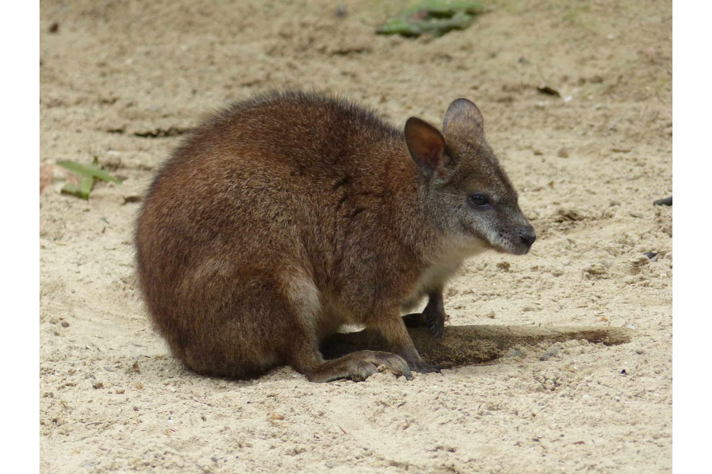
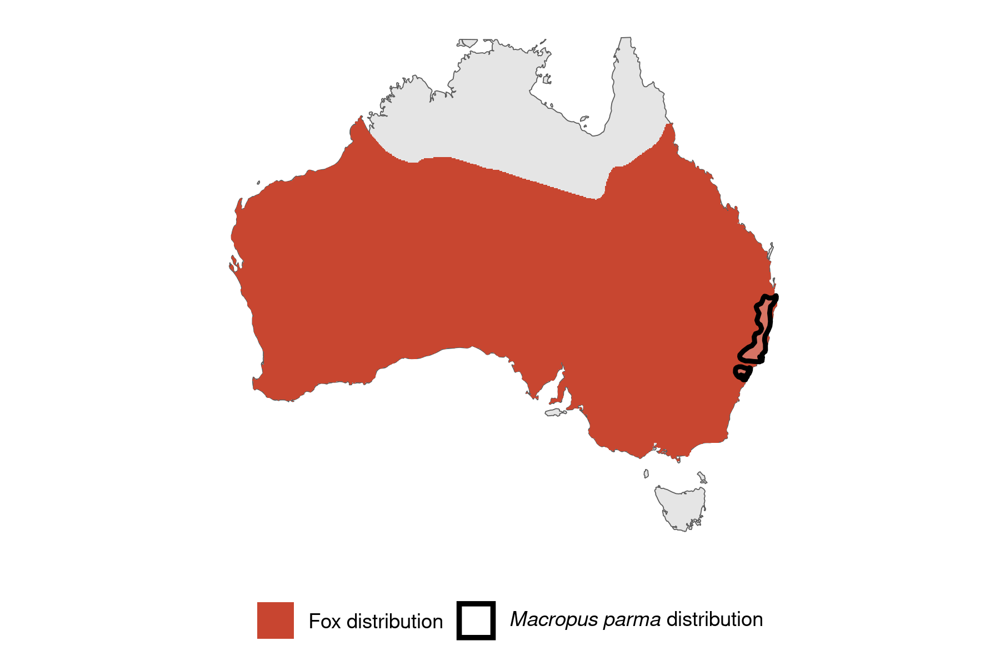

```{css, echo=FALSE}
h1, h2, h3 {
  text-align: center;
}
```

## **Parma wallaby**
### *Macropus parma*
### Blamed on foxes

:::: {style="display: flex;"}

[](https://www.inaturalist.org/photos/48283622?size=original)

::: {}

:::

::: {}
  ```{r map, echo=FALSE, fig.cap="", out.width = '100%'}
  
  ```
:::

::::
<center>
IUCN status: **Near Threatened**

EPBC Threat Rating: **Not assessed**

IUCN claim: *"Forest fragmentation combined with predation from foxes appear to be the principal reasons for the decline of the species. Grazing and burning regimes that affect availability of shelter are a disadvantage to populations (Maxwell et al. 1996). Reintroductions of the species have been unsuccessful due to fox predation."*

</center>

### Studies in support

Found in 1% of fox scats in one site (Glen et al. 2011). In one study, foxes hunted 12 of 12 reintroduced, predator-inexperienced, wallabies (Short et al. 1992).

### Studies not in support

No studies

### Is the threat claim evidence-based?

There are no studies evidencing a negative association between  foxes and parma wallaby populations. The fate of reintroduced animals is not a reliable proxy for the fate of populations.
<br>
<br>

![**Evidence linking *Macropus parma* to foxes.** Systematic review of evidence for an association between *Macropus parma* and foxes. Positive studies are in support of the hypothesis that *foxes* contribute to the decline of Macropus parma, negative studies are not in support. Predation studies include studies documenting hunting or scavenging; baiting studies are associations between poison baiting and threatened mammal abundance where information on predator abundance is not provided; population studies are associations between threatened mammal and predator abundance.](assets/figures/Main_Evidence_Fox_Macropus parma.png)

### References

Glen, A.S., Pennay, M., Dickman, C.R., Wintle, B.A. and Firestone, K.B., 2011. Diets of sympatric native and introduced carnivores in the Barrington Tops, eastern Australia. Austral Ecology, 36(3), pp.290-296.

Wallach et al. 2023 In Submission

