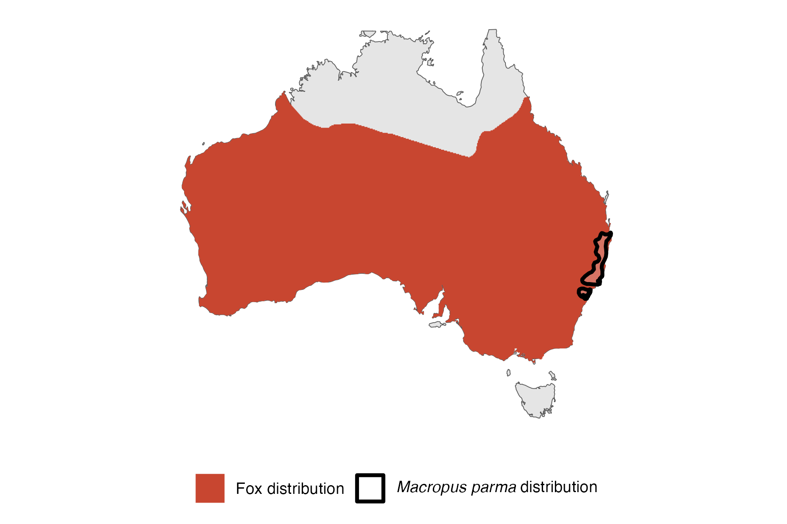
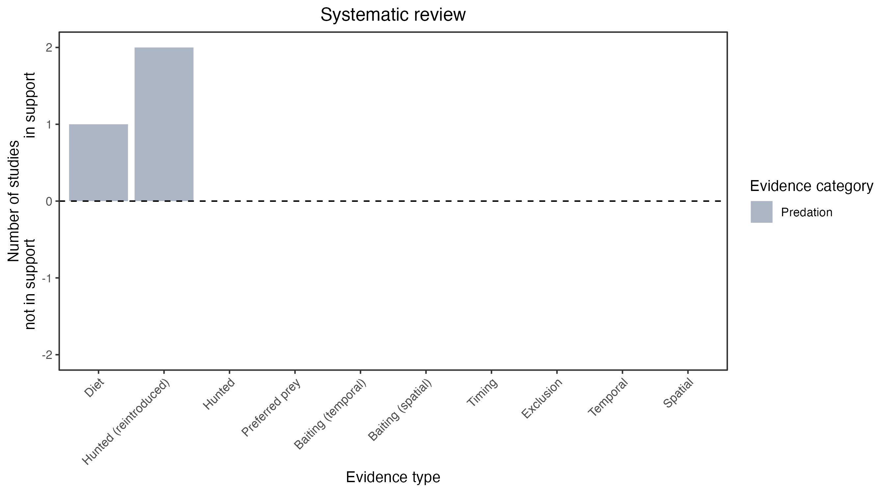

```{css, echo=FALSE}
h1, h2, h3 {
  text-align: center;
}
```

## **Parma wallaby**
### *Macropus parma*
### Blamed on foxes

:::: {style="display: flex;"}

::: {}
  ```{r icon, echo=FALSE, fig.cap="", out.width = '100%'}
  knitr::include_graphics("assets/phylopics/PLACEHOLDER_ready.png")
  ```
:::

::: {}

:::

::: {}
  ```{r map, echo=FALSE, fig.cap="", out.width = '100%'}
  
  ```
:::

::::
<center>
IUCN Status: **Near Threatened**

EPBC Threat Rating: **N/A**

IUCN Claim: *'Forest fragmentation combined with predation from foxes appear to be the principal reasons for the decline of the species. Grazing and burning regimes that affect availability of shelter are a disadvantage to populations (Maxwell et al. 1996). Reintroductions of the species have been unsuccessful due to fox predation.''*

</center>

### Studies in support

Found in 1% of fox scats in one site (Glen et al. 2011). In one study, foxes hunted 12 of 12 reintroduced, predator-inexperienced, wallabies (Short et al. 1992).

### Studies not in support

No studies

### Is the threat claim evidence-based?

There are no studies evidencing a negative association between  foxes and parma wallaby populations. The fate of reintroduced animals is not a reliable proxy for the fate of populations.
<br>
<br>



### References

Glen, A. S., et al. "Diets of sympatric native and introduced carnivores in the Barrington Tops, eastern Australia."†Austral Ecology†36.3 (2011): 290-296.

Short, J., Bradshaw, S. D., Giles, J., Prince, R. I. T., & Wilson, G. R. (1992). Reintroduction of macropods (Marsupialia: Macropodoidea) in Australia—a review. Biological Conservation, 62(3), 189-204.

Wallach et al. 2023 In Submission

