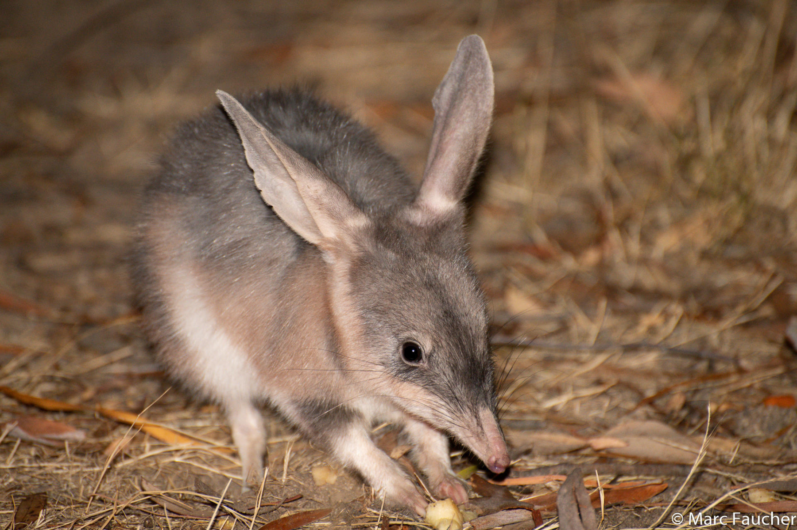

```{css, echo=FALSE}
h1, h2, h3 {
  text-align: center;
}
```

## **Bilby**
### *Macrotis lagotis*
### Blamed on foxes

:::: {style="display: flex;"}

[](https://www.inaturalist.org/photos/30690836?size=original)

::: {}

:::

::: {}
  ```{r map, echo=FALSE, fig.cap="", out.width = '100%'}
  knitr::include_graphics("assets/figures/Map_Fox_Macrotis lagotis.png")
  ```
:::

::::
<center>
IUCN status: **Vulnerable**

EPBC Predator Threat Rating: **Extreme**

IUCN claim: *"The major threat to the Bilby is predation by introduced red foxes and feral cats"*

</center>

### Studies in support

About 70% of bilby extirpation records (36 populations) occurred 1-53 years after foxes arrived and the timing of fox establishment correlates with bilby extirpation across the country (Abbott 2001). Fox probability of occurrence was a negative predictor of bilby occurrence, but model uncertainty was high (Southgate et al. 2007). Bilbies reintroduced inside fenced reserves (excluding foxes, cats and dingoes) have improved survival rates (Moseby et al. 2011).

### Studies not in support

Sixteen bilby populations (~30% of records) were last recorded 0-13 years before foxes arrived (Abbott 2001). Bilbies were last recorded in the Murray-Darling about 20 years before fox arrival (Copley 1999). In one study foxes were not among the predators of reintroduced bilbies (Lohr et al. 2021).

### Is the threat claim evidence-based?

The evidence for a negative association between foxes and bilby populations is inconclusive due to high model uncertainty. A temporal correlation between extirpation and arrival does not prove causation particularly since nearly a third pre-date fox arrival and confounding variables were not tested for.
<br>
<br>

![**Evidence linking *Macrotis lagotis* to foxes.** **A.** Systematic review of evidence for an association between *Macrotis lagotis* and foxes. Positive studies are in support of the hypothesis that foxes contribute to the decline of *Macrotis lagotis*, negative studies are not in support. Predation studies include studies documenting hunting or scavenging; baiting studies are associations between poison baiting and threatened mammal abundance where information on predator abundance is not provided; population studies are associations between threatened mammal and predator abundance. **B.** Last records of extirpated populations relative to earliest local records of foxes. Error bars show minimum and maximum extinction intervals. Predator arrival records were digitized from Fairfax 2019. See methods section in [current submission] for details on evidence categories.](assets/figures/Main_Evidence_Fox_Macrotis lagotis.png)

### References

Abbott, I., 2001. The Bilby Macrotis lagotis (Marsupialia: Peramelidae) in south-western Australia: original range limits, subsequent decline, and presumed regional extinction. Records Western Australian Museum, 20(3), pp.271-306.

Copley, P., 1999. Natural histories of Australia’s stick-nest rats, genus Leporillus (Rodentia: Muridae). Wildlife Research, 26(4), pp.513-539.

Current submission (2023) Scant evidence that introduced predators cause extinctions.

EPBC. (2015) Threat Abatement Plan for Predation by Feral Cats. Environment Protection and Biodiversity Conservation Act 1999, Department of Environment, Government of Australia. (Table A1).

Fairfax, Dispersal of the introduced red fox (Vulpes vulpes) across Australia. Biol. Invasions 21, 1259-1268 (2019).

IUCN Red List. https://www.iucnredlist.org/ Accessed June 2023

Lohr, C.A., Dziminski, M., Dunlop, J., Miller, E. and Morris, K., 2021. Reintroduction of bilbies (Macrotis lagotis) to Matuwa, an Indigenous Protected Area in Western Australia. Rangeland Ecology & Management, 78, pp.67-78.

Moseby, K.E., Read, J.L., Paton, D.C., Copley, P., Hill, B.M. and Crisp, H.A., 2011. Predation determines the outcome of 10 reintroduction attempts in arid South Australia. Biological Conservation, 144(12), pp.2863-2872.

Southgate, R., Paltridge, R., Masters, P. and Carthew, S., 2007. Bilby distribution and fire: a test of alternative models of habitat suitability in the Tanami Desert, Australia. Ecography, 30(6), pp.759-776.

