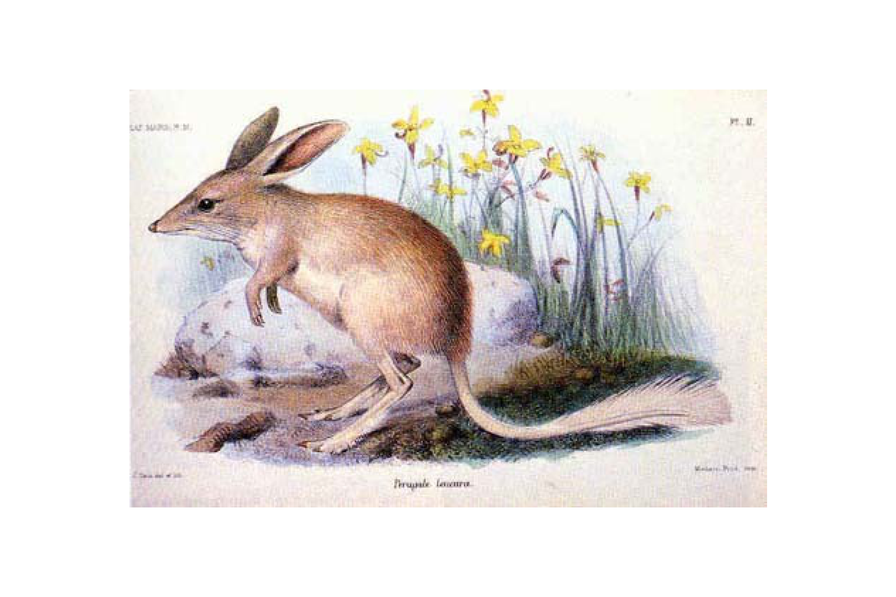
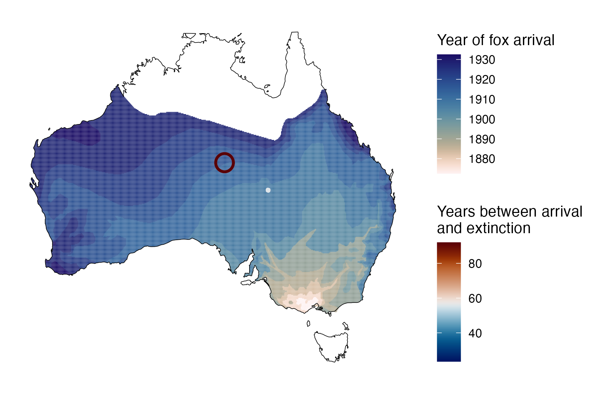
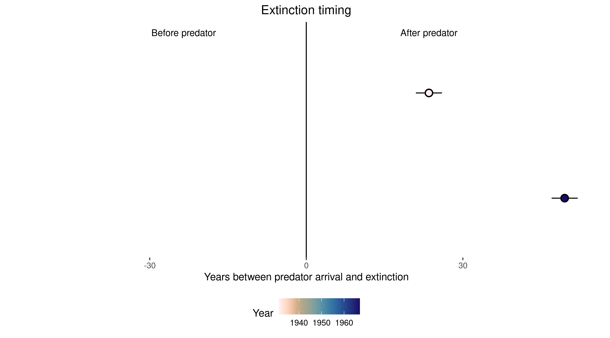

```{css, echo=FALSE}
h1, h2, h3 {
  text-align: center;
}
```

## **Lesser bilby**
### *Macrotis leucura*
### Blamed on foxes

:::: {style="display: flex;"}

::: {}

[](https://www.inaturalist.org/photos/136748?size=original)

:::

::: {}

:::

::: {}
  ```{r map, echo=FALSE, fig.cap="", out.width = '100%'}
  
  ```
:::

::::

<center>
IUCN status: **Extinct**

Last seen: *Macrotis leucura were last seen in 1967 in Alice Springs near the edge of the Simpson Desert (IUCN 2023)*

IUCN claim: *"Predation from introduced feral cats and red foxes is considered to be the major cause of extinction, probably exacerbated by changes in fire regime."*

</center>


### Studies in support

Lesser bilbies were last confirmed 24 and 50 years after foxes arrived (Current submission).

### Studies not in support

No studies

### Is the threat claim evidence-based?

There are no studies evidencing a link between foxes and the extinction of lesser bilbies. The two species co-occurred for half a century in one locale.
<br>
<br>



### References


Current submission (2023) Scant evidence that introduced predators cause extinctions.

Fairfax, Dispersal of the introduced red fox (Vulpes vulpes) across Australia. Biol. Invasions 21, 1259-1268 (2019).

IUCN Red List. https://www.iucnredlist.org/ Accessed June 2023

