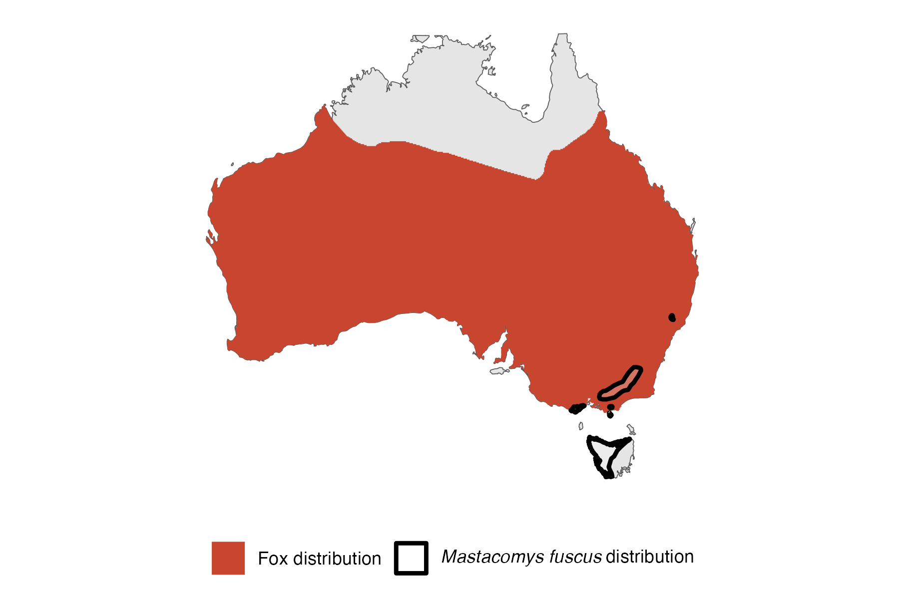

```{css, echo=FALSE}
h1, h2, h3 {
  text-align: center;
}
```

## **Broad-toothed rat**
### *Mastacomys fuscus*
### Blamed on foxes

:::: {style="display: flex;"}

[](https://www.inaturalist.org/photos/63617025?size=original)

::: {}

:::

::: {}
  ```{r map, echo=FALSE, fig.cap="", out.width = '100%'}
  
  ```
:::

::::
<center>
IUCN status: **Near Threatened**

EPBC Predator Threat Rating: **High**

IUCN claim: *"The species is threatened by predation from introduced foxes (Vulpes vulpes) (Bubela and Happold 1993, Green 2002) and Domestic Cats (Felis catus) (L. Broome pers. comm., Milner et al. 2015)."*

</center>

### Studies in support

Foxes hunt broad-toothed mice (Brunner et al. 1975; Seebeck 1978; Green & Osborne 1981; Dickman & McKechnie 1985; Bubela & Happold 1993; Bubela et al. 1998; Green 2002, 2003; Davis et al. 2015).

### Studies not in support

No studies

### Is the threat claim evidence-based?

There are no studies linking foxes to broad-toothed mouse population trends.
<br>
<br>

![**Evidence linking *Mastacomys fuscus* to foxes.** Systematic review of evidence for an association between *Mastacomys fuscus* and foxes. Positive studies are in support of the hypothesis that *foxes* contribute to the decline of Mastacomys fuscus, negative studies are not in support. Predation studies include studies documenting hunting or scavenging; baiting studies are associations between poison baiting and threatened mammal abundance where information on predator abundance is not provided; population studies are associations between threatened mammal and predator abundance. See methods section in [current submission] for details on evidence categories.](assets/figures/Main_Evidence_Fox_Mastacomys fuscus.png)

### References

Brunner, H., Lloyd, J.W. and Coman, B.J., 1975. Fox scat analysis in a forest park in south-eastern Australia. Wildlife Research, 2(2), pp.147-154.

Bubela, T.M. and Happold, D.C.D., 1993. The social organisation and mating system of an Australian subalpine rodent, the broad-toothed rat, Mastacomys fuscus Thomas. Wildlife Research, 20(4), pp.405-417.

Current submission (2023) Scant evidence that introduced predators cause extinctions.

Davis, N.E., Forsyth, D.M., Triggs, B., Pascoe, C., Benshemesh, J., Robley, A., Lawrence, J., Ritchie, E.G., Nimmo, D.G. and Lumsden, L.F., 2015. Interspecific and geographic variation in the diets of sympatric carnivores: dingoes/wild dogs and red foxes in south-eastern Australia. PloS One, 10(3), p.e0120975.

Dickman, C.R. and McKechnie, C.A., 1985. A survey of the mammals of Mount Royal and Barrington Tops, New South Wales. Australian Zoologist, 21(6), pp.531-544.

EPBC. (2015) Threat Abatement Plan for Predation by Feral Cats. Environment Protection and Biodiversity Conservation Act 1999, Department of Environment, Government of Australia. (Table A1).

Green, K. and Osborne, W.S., 1981. The diet of foxes, Vulpes vulpes (L.), in relation to abundance of prey above the winter snowline in New South Wales. Wildlife Research, 8(2), pp.349-360.

Green, K., 2002. Selective predation on the broad‐toothed rat, Mastacomys fuscus (Rodentia: Muridae), by the introduced red fox, Vulpes vulpes (Carnivora: Canidae), in the Snowy Mountains, Australia. Austral Ecology, 27(4), pp.353-359.

Green, K., 2003. Altitudinal and temporal differences in the food of foxes (Vulpes vulpes) at alpine and subalpine altitudes in the Snowy Mountains. Wildlife Research, 30(3), pp.245-253.

IUCN Red List. https://www.iucnredlist.org/ Accessed June 2023

Seebeck, J.H., 1978. Diet of the fox Vulpes vulpes in a western Victorian forest. Australian Journal of Ecology, 3(1), pp.105-108.

