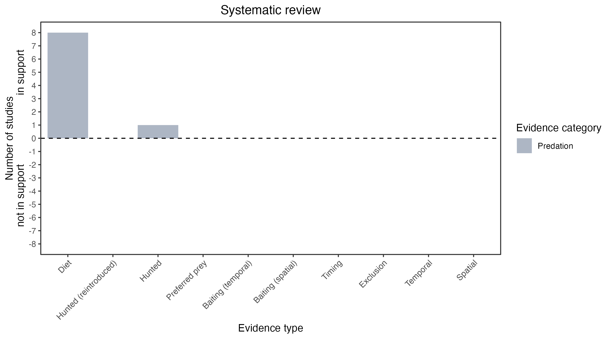

```{css, echo=FALSE}
h1, h2, h3 {
  text-align: center;
}
```

## **Broad-toothed mouse**
### *Mastacomys fuscus*

:::: {style="display: flex;"}

::: {}
  ```{r icon, echo=FALSE, fig.cap="", out.width = '100%'}
  knitr::include_graphics("assets/phylopics/PLACEHOLDER_ready.png")
  ```
:::

::: {}

:::

::: {}
  ```{r map, echo=FALSE, fig.cap="", out.width = '100%'}
  knitr::include_graphics("assets/figures/Map_Fox_Mastacomys fuscus.png")
  ```
:::

::::
<center>
IUCN Status: **Near Threatened**

EPBC Threat Rating: **High**

IUCN Claim: *The species is threatened by predation from introduced foxes (Vulpes vulpes) (Bubela and Happold 1993, Green 2002) and Domestic Cats (Felis catus) (L. Broome pers. comm., Milner et al. 2015).'*

</center>

### Studies in support

Foxes hunt broad-toothed mice (Brunner et al. 1975; Seebeck 1978; Green & Osborne 1981; Dickman & McKechnie 1985; Bubela & Happold 1993; Bubela et al. 1998; Green 2002, 2003; Davis et al. 2015).

### Studies not in support

No studies

### Is the threat claim evidence-based?

There are no studies linking foxes to broad-toothed mouse populations.
<br>
<br>



### References

Bubela, T. M., and D. C. D. Happold. "The social organisation and mating system of an Australian subalpine rodent, the broad-toothed rat, Mastacomys fuscus Thomas." Wildlife Research 20.4 (1993): 405-417.

Davis NE, Forsyth DM, Triggs B, Pascoe C, Benshemesh J, Robley A, et al. (2015) Interspecific and Geographic Variation in the Diets of Sympatric Carnivores: Dingoes/Wild Dogs and Red Foxes in South-Eastern Australia. PLoS ONE 10(3): e0120975. https://doi.org/10.1371/journal.pone.0120975

Green, K., & Osborne, W. (1981). The Diet of Foxes, Vulpes Vulpes (L.), In Relation to Abundance of Prey Above the Winter Snowline in New South Wales. Wildlife Research, 8(2), 349. doi:10.1071/wr9810349 

Bubela, Tania M., C. R. Dickman, and A. E. Newsome. "Diet and winter foraging behaviour of the red fox (Vulpes vulpes) in alpine and subalpine New South Wales." Australian Mammalogy 20.3 (1998): 321-330.

Green, K. (2003). Altitudinal and temporal differences in the food of foxes (Vulpes vulpes) at alpine and subalpine altitudes in the Snowy Mountains. Wildlife Research, 30(3), 245. doi:10.1071/wr02008 

Green, K. (2002). Selective predation on the broad-toothed rat, Mastacomys fuscus (Rodentia: Muridae), by the introduced red fox, Vulpes vulpes (Carnivora: Canidae), in the Snowy Mountains, Australia. Austral Ecology, 27(4), 353–359. doi:10.1046/j.1442-9993.2002.01187.x 

Dickman, C. R., and C. A. McKechnie. "A survey of the mammals of Mount Royal and Barrington Tops, New South Wales." Australian Zoologist 21.6 (1985): 531-544.

Brunner, H., Lloyd, J., & Coman, B. (1975). Fox Scat Analysis in a Forest Park in South-Eastern Australia. Wildlife Research, 2(2), 147. doi:10.1071/wr9750147

Seebeck, J. H. (1978). Diet of the fox Vulpes vulpes in a western Victorian forest. Austral Ecology, 3(1), 105–108. doi:10.1111/j.1442-9993.1978.tb00856.x 

Wallach et al. 2023 In Submission

